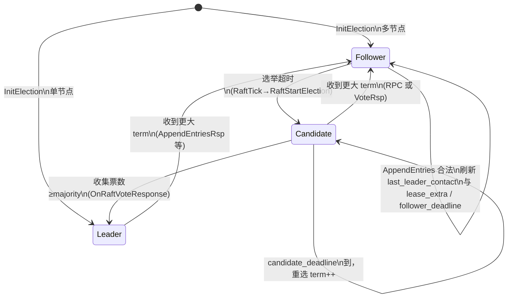

# Center 多节点选主与注册一致性设计说明

本文档描述 Thunder **Center 集群**从「心跳启发式选主」迁移为 **Raft** 后的目标架构、协议约定、客户端行为，以及与 **Nacos**、**Redis 生态**等常见组件的对比。**§14 实现细节**、**§15 Raft 流程**与当前仓库代码一致；更早章节中与设计稿有出入的，以 §14 / §15 为准。

---

## 1. 背景与问题

- **现状**：Center 之间通过 `CMD_REQ_LEADER_ELECTION` 与 `coor.Election`（`is_leader`、`beleadertime` 等）配合 `SessionOnlineNodes::CheckLeader` 做选主，语义非标准 Raft，存在脑裂与理解成本。
- **全局 `node_id`**：多 Center 下若各节点本地递增分配，易冲突；历史上 `Election` 中 `last_node_id` / `added_node_id` / `removed_node_id` 在 `SendCenterBeat` 中未启用。
- **目标**：Center 间 **CP 语义** 的选主 + **最小复制日志** 同步 `node_id` 等关键状态；业务侧 **明确发现主**、**稳态只连主心跳**；**去掉** `IsLeadership()` 的「代理 leader」。

---

## 2. 设计目标（摘要）

| 项 | 说明 |
|----|------|
| Center ↔ Center | 删除旧 `SendCenterBeat` / `CheckLeader` / `AddCenterBeat` 选主路径，改为 Raft（RequestVote、AppendEntries、term 等）。 |
| 业务 ↔ Center | 三态心跳：未知主或失主 → 对所有配置的 Center 探测；已知主 → **仅对 Leader** 发 `NodeReport` 类心跳。 |
| 主中心下发 | 变更推送（如 `SendNodeNotice`）仍 **仅真 Raft Leader**；`IsLeadership()` 与 Raft Leader 严格一致，**无代理 leader**。 |
| `node_id` | **仅 Leader** 经日志提议，**提交后** Follower apply；业务节点启动获取一次后本地缓存，延迟可接受。 |
| 交付 | **不做**新旧双轨开关；**以测试为验收**；集群需全量升级到新 Center。 |

---

## 3. 架构与职责划分

```mermaid
flowchart LR
  subgraph biz [业务节点]
    N[ACCESS_LOGIC等]
  end
  subgraph centers [Center 集群]
    L[RaftLeader]
    F[RaftFollower]
  end
  N -->|阶段1或3: 多Center探测| L
  N -->|阶段1或3| F
  N -->|阶段2: 仅心跳| L
  L -->|NodeNotice等推送| N
  L <-->|Raft RPC| F·
```

- **Raft 心跳**（Center 间）与 **业务心跳**（`NodeReport` / `CheckNodesBeat`）分离配置与时序。
- **Follower** 上 `CheckNodesBeat`：**不得**仅因稳态业务不再直连本机就按本地 `active_time` 误删实例；剔除与权威注册以 **Leader 已提交状态** 为准。

---

## 4. 协议约定

### 4.1 `NodeReportRsp`（`oss_sys.proto`）

业务发现主与错误语义 **固定绑定**在 **`NodeReportRsp`**（[`CmdNodeRegister`](../code/Center/src/CmdNodeRegister/CmdNodeRegister.cpp)、[`CmdNodeReport`](../code/Center/src/CmdNodeReport/CmdNodeReport.cpp) 共用）。

**已实现字段**（`oss_sys.proto` → `NodeReportRsp`）：

- `string current_leader_identify = 3` — 当前稳定 Raft Leader，形式与 `GetWorkerIdentify()` / `centers` 展开一致（如 `ip:port.0`）。
- `uint64 raft_term = 4` — 本机已知 Raft 任期。

**`errcode`（proto 注释 + 服务端行为）**：

| 值 | 含义 |
|----|------|
| 0 | 成功；在已知稳定 Leader 时 **必须** 填 `current_leader_identify`；`node_id` 等按原语义。 |
| 1 | 解析失败、Leader 上非常规 `AddNode` 失败等；**若本机已知稳定 Leader**（如连在 Follower 上无法发号），**仍会填** `current_leader_identify`，便于客户端 **改连 Leader**（非 HTTP 302 式转发，由客户端自选目标）。 |
| 2 | `ERR_NO_RAFT_LEADER`：**尚无稳定可服务 Leader**（选主中、未收到 Leader 的 AppendEntries、Candidate 等）。**`current_leader_identify` 必须留空**（仅 `raft_term` 等可带本地值）；不写新 `node_id`；客户端应 **退避重试 / 换 Center**。 |

回包统一由 `SessionOnlineNodes::FillNodeReportRspRaftForResponse(rsp, errcode)` 按上表填 `raft_term` / `current_leader_identify`。

### 4.2 `coor.proto` / Center 间 RPC

- **命令字**（`CW.hpp`，应答 = 请求 + 1）：
  - `CMD_REQ_RAFT_REQUEST_VOTE` = 43 / `CMD_RSP_RAFT_REQUEST_VOTE` = 44
  - `CMD_REQ_RAFT_APPEND_ENTRIES` = 45 / `CMD_RSP_RAFT_APPEND_ENTRIES` = 46
- **消息体**（`coor.proto`）：
  - `RaftRequestVote` / `RaftRequestVoteRsp`（含 `next_node_id_alloc_hint`、`voter_next_node_id_alloc_hint`）
  - `RaftAppendEntries` / `RaftAppendEntriesRsp`（含 `leader_next_node_id_alloc`；当前实现 **不携带真实日志条目**，作心跳 + 游标同步）
- 历史上 Center 间曾用 CMD 41 + `coor.Election` 报文选主，**已从代码与 proto 中移除**；仅保留 Raft 43/45。

---

## 5. 客户端行为（业务进程）

1. **重试直至识别拓扑**：持续重试（含 `errcode==2` 退避），直到从 `NodeReportRsp` 获知 **当前 Leader** 及 **本连接对端相对主从关系**。
2. **稳态**：**只对 Leader** 发送周期 `NodeReport`（心跳）。
3. **切主或与主失联**：回到 **全 Center 列表探测**，再收敛到 **只心跳新主**。
4. **`errcode==2`** 视为 **可恢复**（无稳定 Leader，回包无 `current_leader_identify`）。**`errcode==1`** 且带 `current_leader_identify` 时，优先 **改连该 Leader** 再试写类请求；勿与解析类永久失败混为一谈。

---

## 6. 集群规模：1 台与 2 台

Raft 多数派为 **⌊n/2⌋+1**。

- **n=1**：单节点退化，**自举 Leader**，无双主问题。
- **n=2**：**两机互通且能互相投票** 时才能选出 Leader（需 2 票）。任一侧宕机或 1↔1 网络分区时，**两侧都无法满足多数** → **选不出 Leader**（大量 `errcode==2`）。这是 **用停写换不强造双主**；正确实现下 **不应** 出现「合法双主」，若出现按 Bug 处理。通信恢复后重新选举，**可恢复正常**。
- 更高容错建议 **≥3 奇数节点** 或 witness（本设计不展开）。

---

## 7. 路由视图与读写分工

| 类型 | 承担者 | 说明 |
|------|--------|------|
| 权威写（含新 `node_id` 分配） | 仅 Raft Leader | Follower **不转发 RPC**：新注册/发号失败返回 **errcode=1** 并带 `current_leader_identify`（若已知）；**无稳定 Leader** 时返回 **errcode=2** 且 **不留** leader 字段。 |
| 日志复制 / Follower 状态 | AppendEntries + apply | 「主带从」体现在复制与 apply。 |
| 推送（如 `SendNodeNotice`） | 仅真 Leader | 与 `IsLeadership()` 一致。 |
| 选主窗口内的「路由视图」查询 | Candidate / Follower | 仅返回本地 **已提交（last applied）** 的 **只读** 视图，**可能陈旧**；不得非法定 Leader 上提交新的全局冲突写。 |

---

## 8. 与 Nacos 的对比

Nacos 命名服务常见路径：**临时实例 Distro（AP）**；部分场景 **JRaft（CP）**。下表为典型对照，非逐版本绑定实现细节。

| 维度 | Thunder 本方案 | Nacos（典型） |
|------|----------------|---------------|
| 一致性模型 | **CP**：注册 / `node_id` 以 Raft **已提交** 为准 | **AP 为主**：Distro 下常先本节点成功再异步同步，最终一致 |
| 写延迟 | 较高（Leader + 复制；Follower 需转发） | 通常较低（连任意节点可登记临时实例） |
| 读 | Follower 可提供只读副本（陈旧度需约定） | 任意节点查询，可能略旧 |
| 分区行为 | 少数派不可写；可能无 Leader（如 2 节点分区） | Distro 各自接流量，不一致风险由 AP 语义吸收 |
| 生态 | 自研嵌入，与现有 Center/Net 耦合 | 控制台、多语言客户端、社区文档成熟 |
| 适用 | 强依赖 **全局唯一 node_id**、**单主推送**、不接受注册分叉 | 通用服务发现、强调接入快与写成功快 |

**结论**：若目标是 **强一致 ID + 单主**，与 Nacos 默认 AP 路径 ** intentionally 不同**；要对齐 Nacos 的写延迟，需弱化一致性或接受 ID/视图风险。

---

## 9. 与 Redis 生态的对比

Redis **数据面**与 **Thunder Center 控制面**不完全同类，对照目的是避免「客户端像 Redis 那样工作」的误解。

| 模式 | 客户端如何找到主 / 拓扑 | 与 Thunder 的类比 |
|------|-------------------------|-------------------|
| **主从 + Sentinel** | 连 **Sentinel**，`SENTINEL get-master-addr-by-name` 等拿 master；故障检测在 Sentinel 集群 | 类似能力可用 **独立发现服务** 演进；当前 v1 用 **`NodeReportRsp` + 多 Center 探测** 替代 Sentinel |
| **Redis Cluster** | seed 节点 + **MOVED/ASK**、`CLUSTER SLOTS` 学习分片 | Thunder 无 slot 路由；业务只需 **Leader 身份** 与 **单主心跳** |
| **redisraft** | Raft 在服务端；客户端常仍连 **单地址或代理** | Raft 位置类似（Center 进程内）；业务 **不参与** Raft RPC |

**结论**：Thunder 的「先全 Center、再只主、失主再全」是 **无独立 Sentinel 时** 的工程折中；若未来要「更像 Redis」，可抽象 **轻量发现接口**，减少全列表盲发。

---

## 10. 与其他系统的简要对照（可选参考）

| 系统 | 选主 / 一致性 | 客户端发现主 |
|------|----------------|--------------|
| **etcd / Consul** | Raft，强一致 | 通常连任意成员读；写走 Raft；部分 API 可返回 leader 提示 |
| **ZooKeeper** | ZAB，强一致 | 客户端会话与 watch；无完全相同的「NodeReportRsp」模式 |

Thunder 选择 **业务侧固定解析 `NodeReportRsp`**，以降低客户端改造面。

---

## 11. 关键代码与配置（入口索引）

- 选主与节点表：[`SessionOnlineNodes.cpp`](../code/Center/src/SessionOnlineNodes.cpp)、[`SessionOnlineNodes.hpp`](../code/Center/src/SessionOnlineNodes.hpp)
- **Raft 状态机（独立 Session）**：[`SessionRaftCluster.cpp`](../code/Center/src/SessionRaftCluster.cpp)、[`SessionRaftCluster.hpp`](../code/Center/src/SessionRaftCluster.hpp)
- 注册 / 上报：[`CmdNodeRegister.cpp`](../code/Center/src/CmdNodeRegister/CmdNodeRegister.cpp)、[`CmdNodeReport.cpp`](../code/Center/src/CmdNodeReport/CmdNodeReport.cpp)
- Center 间 Raft 插件：[`CmdRaftRequestVote`](../code/Center/src/CmdRaftRequestVote/CmdRaftRequestVote.cpp)（CMD 43）、[`CmdRaftAppendEntries`](../code/Center/src/CmdRaftAppendEntries/CmdRaftAppendEntries.cpp)（CMD 45）。
- 消息定义：[`coor.proto`](../code/Proto/coor.proto)
- 业务协议：[`oss_sys.proto`](../code/Net/src/protocol/oss_sys.proto)
- 命令字：[`CW.hpp`](../code/Net/include/cmd/CW.hpp)
- 进程 `so` 映射：`Center.json` 中 **cmd 43 → `CmdRaftRequestVote.so`**、**cmd 45 → `CmdRaftAppendEntries.so`**（见 `deploy/Center/conf/Center.json` 等部署目录）

**算法级流程见 §15；字段级行为见 §14。**

---

## 12. 风险与测试验收

- 分区：**minority 不当选**；双节点分区 **无合法 Leader**、**无双主**（实现正确前提下）。
- 客户端：三态、`errcode==2` 重试、切主再探主。
- `node_id` 不重复、无长期双主；Follower 不误删。
- 单节点自举；选主窗口只读视图（若实现）。

**验收标准**：以 **单测 + 多 Center 集成测试** 通过为交付门槛；不单独写灰度/双协议上线清单。

**当前仓库**：已提供可执行目标 **`thunder_test_center_raft`**（[`code/test/center/test_center_raft.cpp`](../code/test/center/test_center_raft.cpp)），校验多数派 ⌊n/2⌋+1 与 2 节点需 2 票等规则；多进程集成仍需按环境搭建。

---

## 13. 建议实施顺序（历史）

以下顺序已在主干落地；保留作变更溯源。

1. 修改 `oss_sys.proto` / `coor.proto`，生成代码；新增 Raft CMD。
2. 实现 Raft（含单节点、两节点多数派语义）；删除旧 Center 间选举代码；`IsLeadership()` 去掉代理。
3. `CmdNodeRegister` / `CmdNodeReport` 填充 `NodeReportRsp`；Follower 侧通过 errcode 提示客户端连 Leader。
4. 业务客户端按第 5 节改造；跑通测试。

---

## 14. 实现细节（与当前代码一致）

### 14.1 状态机与角色

- 枚举 `CenterRaftRole`：`Follower` / `Candidate` / `Leader`。
- **稳定 Leader 判定**（`RaftHasStableLeader()`）：非 `Candidate` 且 `m_raftLeaderId` 非空（Follower 在首次合法 `AppendEntries` 后写入 `leader_id`）。
- **`IsLeadership()`**：`need_leadership==true` 时 **仅** `m_bIsLeader`（与 Raft Leader 一致，**无代理 leader**）；`need_leadership==false` 时为恒 true。

### 14.2 定时与 Tick

- **`SessionRaftCluster::Timeout()`**（独立 Session 定时器）：**每次**调用 `RaftTick(now)`（`now = GetLabor()->GetTimeStamp()`）；与 `SessionOnlineNodes::Timeout()` **分离**——后者只负责 `CheckNodesBeat` / `CheckSendingNodeNotice` 等业务节拍，**不**驱动 Raft。
- **Leader** 按配置 **`center_beat`**（秒，`m_uiCenterBeat`，默认 3）周期向所有远端发 **`RaftAppendEntries`**（空日志心跳）；节拍复用成员 **`m_uiLastSendCenterBeat`** 与 wall 时钟 `GetNowTime()`，与业务 `CheckNodesBeat` 独立。
- **选举 / 租约**（`SessionRaftCluster.cpp` 匿名命名空间，秒级，`now` 与 `GetTimeStamp()` 一致）：
  - **冷启动**（`m_raftFollowerDeadline`，路径：`last_leader_contact==0` 或授票时延后抢选）：`kFollowerColdStartBase` 0.20 + `U(0,1)*kFollowerColdStartRand` 0.30 → 约 [0.20, 0.50]s；与 1s Session 周期配合尽快首轮选主。
  - **跟主租约**（`last_leader_contact>0`）：`kFollowerLeaseCenterBeatMult`（2）× `max(1, m_uiCenterBeat)` + `m_raftFollowerLeaseExtra`；每次合法 **AppendEntries** 重置 `m_raftFollowerLeaseExtra = kFollowerLeaseMarginBase`（1.0）+ `U(0,1)*kFollowerLeaseMarginRand`（0.5）。默认 `center_beat=3` 时租约约 7～7.5s，大于单格心跳，避免误判掉主。
  - **Candidate** 重试：`kCandidateRetryBase` 0.08 + `U(0,1)*kCandidateRetryRand` 0.12。

### 14.3 成员与单节点

- **`SessionRaftCluster::Init`**：`centers` 数组优先来自 **`CenterCmd.json`**；若缺省或 **空数组**，则回退读取主配置 **`Center.json` 的 `custom.centers`**（与进程 inner 列表同源，避免只改一处却 Raft 仍读空成员表）。
- `InitElection(centers)`：将配置项 `host:port` 展开为 **`ip:port.0`** 加入 `m_raftClusterPeers`；若展开后的集合 **不含本机** `GetWorkerIdentify()`，则 **自动补入本机** 再排序（防止「只配了其它 Center」时 `|peers|=1` 且 `majority=1`、仅凭自票误选主，表现为多进程 **各自 leader=yes**）。
- `m_raftRemotePeers` 为除本机外的列表。
- **多数派**：`m_raftMajority = max(1, ⌊n/2⌋+1)`，`n = peers.size()`。
- **单节点自举**（`m_raftSingleNode`）：**仅当** `m_raftClusterPeers.size()==1` **且** 唯一成员 **等于本机 identify**。`centers` 空数组时先压入本机，满足「无对等」自举。
- 单节点：`term=1`，立即 `Leader`，`m_raftLeaderId=self`。多节点：初始 `Follower`，`term=0`，按 Follower 截止触发 `RaftStartElection`。

### 14.4 RequestVote / AppendEntries 行为摘要

- **投票**：term 落后则拒绝；term 更高先 `RaftBecomeFollower`；**当前任期内已是 Leader** 则拒绝同 term 外来投票；`votedFor` 空或等于候选人则授予（`vote_granted`）。授票方**不**根据 `next_node_id_alloc_hint` 改本地游标；候选人仅在收到 `vote_granted` 的应答里对 `voter_next_node_id_alloc_hint` 做 max；全集群游标仍以 Leader 的 **AppendEntries** 为主对齐。
- **AppendEntries**：term 校验与步下；更新 `m_raftLeaderId`、`m_raftLastLeaderContact`；`leader_next_node_id_alloc > 0` 时与本地 **取 max** 更新游标。
- **日志**：`last_log_index` / `prev_log_*` / `leader_commit` **未用于真实条目一致性**（v1 无持久化日志，内存状态机）。

### 14.5 `node_id` 分配与复制

- **仅 Leader** 在 `AddNode` 中调用 `AllocNextNodeId()` 递增 **`m_uiNextNodeIdAlloc`**（环形 `[1, NODE_ID_MAX)`）。
- **Follower** 不写全局游标：主要通过 **AppendEntries** 的 `leader_next_node_id_alloc` 与 Leader 对齐；对已存在实例允许 **心跳式更新**（不广播、不发号）。
- **非目标**：未实现「每条 node 分配一条 Raft 日志条目」的强持久复制；重启后各节点游标以配置/运行为准，与完整 Raft 论文中的 **已提交日志** 仍有差距。

### 14.6 `CheckNodesBeat` 与 `RemoveNode`

- **`CheckNodesBeat`**：**仅当 `IsLeadership()`** 时扫描超时并 `RemoveNode`（避免 Follower 因业务稳态不连本机而 **误删**）。
- **`RemoveNode`**：本地始终清理表项；**`RemoveNodeBroadcast` / 通知下发** 仅在 `IsLeadership()` 时执行。

### 14.7 `CmdNodeRegister` / `CmdNodeReport` 与 errcode

- 成功：`errcode=0`，`FillNodeReportRspRaftForResponse(..., 0)`。
- **`RaftHasStableLeader()==false`**（注册/上报写路径失败）：`errcode=2`，leader 字段清空。
- **稳定 Leader 但本机非 Leader**（如注册新节点、上报 `node_id==0` 需发号）：`errcode=1`，**带** `current_leader_identify`。
- 解析失败等：`errcode=1`，按是否有稳定 Leader 决定是否带 leader 字段。

### 14.8 Center 间发送路径

- Leader 使用 `GetLabor()->SendToCallback(..., CMD_REQ_RAFT_REQUEST_VOTE / CMD_REQ_RAFT_APPEND_ENTRIES, ...)`；投票回调用 `DataStepCustom` 携带对端 identify 以统计 `m_raftVotesGranted`；达 **多数** 则 `RaftBecomeLeader`。

### 14.9 已知局限（v1）

- **无磁盘持久化**：崩溃重启后 Raft 状态与 `node_id` 游标不保证跨进程恢复；多节点部署需接受 **冷启动重新选主** 与运维层约束。
- **未实现** 业务请求自动 **转发到 Leader**（TCP 层）；由客户端根据 `current_leader_identify` 重试。
- **集成测试**：多 Center 分区/切主依赖部署与客户端三态，仓库内以单测为基线；多进程可参考 `deploy/tests/test_multicenter_raft.sh`。

---

## 15. Raft 算法流程说明（本实现）

本节说明 **当前代码** 中与经典 Raft（Ongaro & Ousterhout）**对齐的部分**与**刻意简化**的部分，便于读代码与排障。更简的字符示意图与选主规则摘要见同目录 [`Center-Raft-ASCII-Flow.md`](Center-Raft-ASCII-Flow.md)。

### 15.1 与经典 Raft 的对应关系

| Raft 概念 | 本实现中的落点 |
|-----------|----------------|
| **任期 term** | `m_raftTerm`；更大 term 的 RPC 迫使本机 `RaftBecomeFollower` |
| **角色** | `CenterRaftRole`：`Follower` / `Candidate` / `Leader` |
| **选举超时 / 租约** | 冷启动：`kFollowerColdStartBase` + `kFollowerColdStartRand` → `m_raftFollowerDeadline`；跟主：`2*center_beat` + `m_raftFollowerLeaseExtra`（AE 重置）；Candidate：`kCandidateRetryBase` + `kCandidateRetryRand` |
| **RequestVote** | CMD 43/44；Candidate 向所有远端并发拉票；`m_raftVotesGranted` 达 **多数派** → `RaftBecomeLeader` |
| **AppendEntries** | CMD 45/46；Leader 周期性发送，作 **心跳** + **leader_next_node_id_alloc** 同步 |
| **日志复制** | **未实现**：`prev_log_index` / `entries` / `leader_commit` 等不参与真实条目匹配与提交 |

### 15.2 单节点与多节点入口

- **单节点**（配置中仅本机或无对等）：`InitElection` 后 `term=1`，直接 **Leader**，不跑选举定时逻辑（`RaftTick` 对单节点立即返回）。
- **多节点**：初始均为 **Follower**，`term=0`；在从未收到 Leader AE 时，首个 **`m_raftFollowerDeadline`（冷启动随机）** 到期后进入 **Candidate**，`term++`，给自己一票并向各 peer 发 **RequestVote**。

### 15.3 状态转换（与代码一致）



### 15.4 选举时序（文字）

1. **Follower** `RaftTick`：若 `m_raftLastLeaderContact>0` 且仍在 **跟主租约**内（`last + 2*max(1,center_beat) + m_raftFollowerLeaseExtra`），或 `last_leader_contact==0` 且尚未到 **`m_raftFollowerDeadline`（冷启动）**，则不发起选举。
2. 超时则 **`RaftStartElection`**：`role=Candidate`，`term++`，`m_raftElectionTerm` 记录本轮 term，`m_raftVotesGranted={self}`，向每个 **remote** `SendToCallback(RequestVote, DataStepCustom(peer))`。
3. 对端 **`HandleRaftRequestVote`**：term 旧则拒绝；term 新则先降为 Follower；**同 term 且本机已是 Leader** 则拒绝外来票；否则在 `votedFor` 允许时 **grant**（授票不改本地 `m_uiNextNodeIdAlloc`）。
4. 本机 **`OnRaftVoteResponse`**：若 `rsp.term > m_raftTerm` → Follower；若已非 Candidate 或 `rsp.term < m_raftElectionTerm` → 忽略陈旧票；若 **`vote_granted`** 则合并 `voter_next_node_id_alloc_hint` 并将 **对端 identify** 记入集合；**`|votes| >= m_raftMajority`** → **`RaftBecomeLeader`**。

### 15.5 稳态心跳时序（文字）

1. **Leader** 在 `SessionRaftCluster::Timeout` 中，每当 wall 时间跨过 **`center_beat`**，调用 **`RaftSendAppendEntriesToAll`**。
2. 每条 **AppendEntries** 带当前 **`leader_next_node_id_alloc`**（及 term、`leader_id` 等）。
3. **Follower** `HandleRaftAppendEntries`：term 校验；更新 **`m_raftLeaderId`**、**`m_raftLastLeaderContact`**，重置 **`m_raftFollowerLeaseExtra`** 与 **`m_raftFollowerDeadline`**（冷启动公式）；用 **`max`** 对齐本地 **`m_uiNextNodeIdAlloc`**。
4. **Leader** 收到 **AppendEntriesRsp** 时，若对端 **term 更大**，则 **`RaftBecomeFollower`**（分区恢复后旧 Leader 让位）。

### 15.6 与完整 Raft 的差异（必读）

- **无持久化日志与 commit 索引**：不保证崩溃恢复后与集群其余节点完全一致；选主与游标以 **内存状态** 为准。
- **AppendEntries 无真实条目**：不执行「日志匹配 + 截断 + 追加」；**不能**按论文推导「已提交」的强语义，仅保证 **term / Leader 视图 / node_id 游标** 的工程收敛。
- **`node_id` 游标**：通过 RPC 字段 **取 max** 对齐，**不是**「一条 Raft 日志提交后再 apply」的模型（见 §14.5）。

### 15.7 代码阅读顺序建议

`SessionRaftCluster::Init` → `InitElection` → `Timeout` → `RaftTick` / `RaftStartElection` → `HandleRaftRequestVote` / `OnRaftVoteResponse` → `RaftBecomeLeader` → `RaftSendAppendEntriesToAll` → `HandleRaftAppendEntries` / `OnRaftAppendEntriesResponse`。

---

*文档版本：2025-03 设计评审 + 2025-03 实现落地（§14）；2025-03 增补 §15 Raft 流程与 §11/§14.2 修正；后续以仓库代码为准。*
