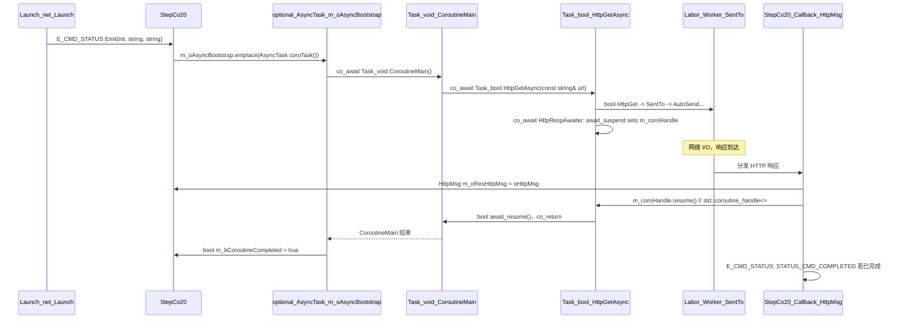
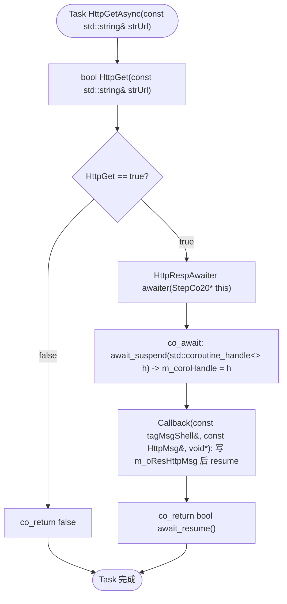

# StepCo20 协程基类迁移说明

本文记录 **保留 `StepCo20`、移除 `CoroutineState`** 的决策与落地变更，便于后续维护与 Code Review。

## 结论

统一使用 **`net::StepCo20`**（继承 `HttpStep`）作为 C++20 协程型 Step 的基类；**`CoroutineState` 与 `StepState` 均已删除**，协程基类不再与旧状态机叠层。

## 为何选 StepCo20 而非 CoroutineState

1. **外层 `AsyncTask` 生命周期**  
   旧 `CoroutineState::Emit` 曾以临时对象启动协程，易导致挂起后帧被析构、回调 `resume` 时崩溃（如 curl 52）。`StepCo20` 使用成员 **`std::optional<AsyncTask> m_oAsyncBootstrap`** 延长外层任务生命周期。

2. **等待模型**  
   `StepCo20` 通过 **`HttpRespAwaiter`** 直接挂起等待一次 HTTP/二进制回调；旧实现经 `WaitForAsync()` 多一层协程间接。

3. **继承链**  
   `CoroutineState` 继承 `StepState`，会把状态机相关成员带进协程类；`StepCo20` 直接继承 `HttpStep`，职责更清晰。

4. **能力**  
   `StepCo20` 提供内部协议异步发送（`SendToInternalAsync` / `ByIdentify` / `ByNodeType`）、超时重试、`ResponseToClient`、`GetLastRspMsgHead/Body/HttpMsg` 等。

## 已完成的代码变更（摘要）

| 类别 | 说明 |
|------|------|
| 删除 | `code/Net/include/step/CoroutineState.hpp`、`code/Net/src/step/CoroutineState.cpp` |
| Redis | `RedisAwaitable` / `RedisCoHelper` 由 `CoroutineState*` 改为 `StepCo20*`；`StepCo20` 对 `RedisAwaitable` 声明 `friend`；实现见 `code/Net/src/step/RedisAwaitable.cpp` |
| 上下文 | `Awaitable.hpp` 中 `CoroutineContext::state` 类型改为 `StepCo20*` |
| Hello 示例 | `HttpRequestCo` 继承 `StepCo20`，入口为 `CoroutineMain()`，返回 `net::Task<>` |
| Interface 注释 | `Interface.hpp`：`Register`/`Init` 针对 `MysqlStep`；协程 Step 多用 `Launch`，超时用 `SetTimeoutParams` |

`code/Net/CMakeLists.txt` 对 `step/*.cpp` 使用 GLOB，删除 `CoroutineState.cpp` 后无需再显式维护该文件名。

## StepCo20 后续改进（可靠性）

- **`HttpRespAwaiter`**：`co_await HttpGetAsync` 等返回的 `bool` 现根据 **`GetLastRspHttpMsg().status_code()`** 判断：仅当 `type == HTTP_RESPONSE` 且状态码在 **[200, 400)** 时为 `true`；内部二进制回调仍视为成功（响应写在 `m_oResMsgHead/Body`）。
- **`RedisAwaitable`**：通过内部 **`RedisStepBridge`（`RedisStep`）** 调用 **`GetLabor()->AutoRedisCmd`**，命令经 **`AppendRawCmd(m_strCommand)`** 走 Worker 既有 hiredis 路径；回调里将 **`redisReply`** 转为 **`RedisReply`** 并 **`resume`** 协程。`AutoRedisCmd` 失败、空命令、无 `StepCo20` 时会立即填错误 `RedisReply` 并恢复协程。

## 示例类与 JSON 选项（Hello / Interface）

- **`StepHttpRequestCo`**（原 `StepHttpRequestCo20`）：多站点串行 `HttpGetAsync` 演示（Hello）。  
  - JSON **`option`**：`TestStepHttpRequestCo`（避免与下面一项重名）。
- **`HttpRequestCo`**：另一路协程 HTTP 演示（含更多站点 / 不同 JSON 字段）。  
  - JSON **`option`**：`TestHttpRequestCo`。

Interface 插件中 **`TestStepHttpRequestCo` / GenKey / VerifyKey** 等已改为 **`net::StepCo20Func` + lambda**（见 `ModuleInterface.cpp`）；Hello 仍保留独立类 **`StepHttpRequestCo`**。联调脚本见 `deploy/tests/test_interface_http_co20.sh`。

## StepState 已删除

**`StepState` 已从代码库移除**（2025–2026 重构）。`MysqlStep` 直接继承 `Step`，超时/错误字段在类内维护；`net::Register(MysqlStep*, …)` 仅用于注册未执行的 MySQL 异步步骤。协程 HTTP 仍用 `StepCo20` + `Launch` / `SetTimeoutParams`。

## 相关文件索引

- 协程 Task / AsyncTask：`code/Net/include/step/Coroutine20.hpp`
- 协程 Step 基类：`code/Net/include/step/StepCo20.hpp`、`code/Net/src/step/StepCo20.cpp`
- 通用 Awaitable：`code/Net/include/step/Awaitable.hpp`
- Redis 协程封装：`code/Net/include/step/RedisAwaitable.hpp`、`code/Net/src/step/RedisAwaitable.cpp`

---

## `HttpGetAsync` 返回 `Task<bool>`：字符流程图（图中标注 `Task` / `promise`）

[`Coroutine20.hpp`](code/Net/include/step/Coroutine20.hpp) · [`StepCo20.cpp`](code/Net/src/step/StepCo20.cpp)

```
父协程体（例: net::Task<void> StepCo20::CoroutineMain()）
  co_await net::Task<bool> StepCo20::HttpGetAsync(const std::string& strUrl)
    |
    |  [子 Task<bool> 可被 co_await 时]
    |  net::Task<bool>::operator co_await() const -> task_awaiter{ coro_ }
    |  bool task_awaiter::await_ready() 常为 false
    |  std::coroutine_handle<> task_awaiter::await_suspend(std::coroutine_handle<> h_父)
    |    -> 子帧 promise_type::set_continuation(h_父)
    |    -> 子 promise.continuation_: std::coroutine_handle<> = h_父
    |    -> return 子 coro_（去跑子协程体；子结束时 final_suspend 再 resume 父）
    v
+--- 子协程帧：Task<bool> HttpGetAsync 本体（编译器生成 + promise_type） ----------------+
|  [协程首次调用入口，先于函数体]                                                        |
|  net::Task<bool> promise_type::get_return_object()                                    |
|    -> Task<bool>{ handle_type coro_ }   // handle_type = std::coroutine_handle<promise_type> |
|  std::suspend_always promise_type::initial_suspend()   // 首段挂起，外层 resume 后进函数体 |
|  ~Task<bool> 时 coro_.destroy() 释帧                                                  |
|                                                                                        |
|  bool HttpStep::HttpGet(const std::string& strUrl)                                     |
|    -> GetLabor()->SentTo(strHost, iPort, strPath, const HttpMsg&, Step* this)           |
|    |                                                                                   |
|    +-- false（发起失败）--------------------------------------------------------------|
|    |  co_return false                                                                 |
|    |  void promise_type::return_value(bool) / 写入 std::optional<bool> value_          |
|    |  void promise_type::unhandled_exception() 若未捕获 -> std::exception_ptr exception_ |
|    |  auto promise_type::final_suspend() -> final_awaiter                             |
|    |    final_awaiter::await_suspend(子句柄) return continuation_  // resume 父协程      |
|    |  父侧 task_awaiter::await_resume() -> promise_type::result() -> bool（读 value_）   |
|    |                                                                                   |
|    true（请求已入队，响应未到）                                                        |
|    |                                                                                   |
|    co_await HttpRespAwaiter   // 与 Task::continuation_ 无关，用 Step 侧槽位            |
|      explicit HttpRespAwaiter(StepCo20* pStep)                                         |
|      bool HttpRespAwaiter::await_ready() noexcept -> false                             |
|      void HttpRespAwaiter::await_suspend(std::coroutine_handle<> h_本帧) noexcept      |
|        -> pStep->m_coroHandle = h_本帧    // StepCo20::m_coroHandle: std::coroutine_handle<> |
|    |                                                                                   |
|    |  [事件循环 / Worker，异步]                                                        |
|    |  Labor::SentTo -> Worker::AutoSend -> HttpCodec::Encode -> pWaitForSendBuff       |
|    |    -> connect(非阻塞) -> EV_WRITE -> Worker::IoWrite -> SendTo -> WriteFD        |
|    |    -> 收包 -> 路由到等待本 Step 的 HTTP 回调                                       |
|    |                                                                                   |
|    |  E_CMD_STATUS StepCo20::Callback(const tagMsgShell& stMsgShell,                    |
|    |                     const HttpMsg& oHttpMsg, void* data = nullptr)                 |
|    |    m_oResHttpMsg: HttpMsg = oHttpMsg    // 另有 MsgHead/MsgBody 回调分支同理       |
|    |    m_uiTimeOutCounter = 0                                                         |
|    |    if (m_coroHandle && !m_coroHandle.done()) m_coroHandle.resume();               |
|    |                                                                                   |
|    bool HttpRespAwaiter::await_resume() noexcept                                       |
|      <- 依据 pStep->m_oResHttpMsg.type() / status_code() 等得到 bool                   |
|    co_return bool b                                                                   |
|      void promise_type::return_value(bool) -> value_                                  |
|      final_suspend -> final_awaiter -> resume(continuation_) 回到父协程                |
|      父 co_await 表达式：task_awaiter::await_resume() -> result() 得 bool              |
+----------------------------------------------------------------------------------------+
```

---

## 补充：`Emit`～`HttpGetAsync`（Mermaid）

### 从 `Emit` 到一次 `HttpGetAsync`



### Mermaid：`HttpGetAsync` 内部分支



### 与「LazyCoroutine + 手动 resume」的对比（选型备忘）

| 方式 | 适用场景 |
|------|----------|
| **LazyCoroutine**：`initial_suspend` + 外部 `handle.resume()` | 教学、生成器、**与事件循环无关**的步调控制。 |
| **HttpRespAwaiter + Worker::Callback** | 响应由 **libev / Worker** 在任意时刻到达，必须把 **`resume` 接到既有回调链**；自定义 awaiter 是合理做法。 |

因此在本框架里**不能**只靠 `std::suspend_always` 或 Lazy 风格替代 **`HttpRespAwaiter`**，除非把整个 HTTP 完成通知改到同一套驱动模型里。
