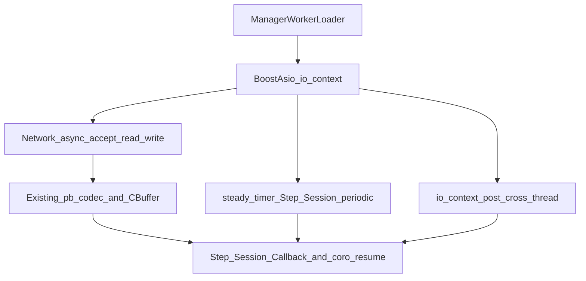

# libev → Boost.Asio（io_uring）迁移设计说明

本文档对 `thunder` 将 **libev 事件模型整体替换为 Boost.Asio，并在支持条件下启用 io_uring 后端** 的可行性、改动量、优缺点、性能与稳定性、业界参考进行归纳。  
更精简的待办清单见同目录下的 [asio-uring-migration_7e18f4ba.plan.md](asio-uring-migration_7e18f4ba.plan.md)。

---

## 1. 背景：当前事件模型与耦合点

### 1.1 核心路径

| 层次 | 角色 | libev 用法 |
|------|------|------------|
| `Labor` | Manager/Worker/Loader 基类 | `ev_async`（`PostToEventLoop`）、`ev_io` / `ev_timer` / `ev_signal` |
| `Manager` | 父进程、监听、Worker IPC、Center | `ev_loop_new(…EPOLL…)`、`ev_run`、`IoCallback` 驱动读/写/超时 |
| `Worker` | 业务子进程 | 同上 + Step/Session 超时定时器 |
| `Loader` | 配置子进程 | `ev_loop_new`、`ev_timer` 周期任务 |
| `tagConnectionAttr` | 每连接 | `ev_io*`、`ev_timer*` |
| `Step` / `Session` | 状态机 / 会话 | `ev_timer*` 超时 |
| `StepCo20` | C++20 协程 Step | `CoSleepAwaiter` 通过 **一次性 `ev_timer`** 在事件线程 `resume()` |
| Redis | hiredis-vip | `adapters/libev.h` + `RedisClusterLibevAttach.hpp` |
| MySQL | 非阻塞 C API | `MysqlAsyncConn` 内嵌 `ev_io` 驱动状态机 |

### 1.2 与现有文档的关系（迁移后替代 / 保留）

以下文档描述的是 **在 libev 事件线程上** 的协程、线程池与 IO 回调语义；迁移后 **事件后端变为 Asio**，但 **“同一线程 resume、跨线程 Post 回事件线程”** 的产品约束仍应保留：

| 文档 | 迁移后 |
|------|--------|
| [StepCo20-threadpool-integration-design.md](StepCo20-threadpool-integration-design.md) | **`PostToEventLoop` / 线程池 offload 语义保留**；实现从 `ev_async_send` 改为 `io_context.post`（或等价）。协程仍须在事件线程 `resume`。 |
| [StepCo20-coroutine-migration.md](StepCo20-coroutine-migration.md) | **Awaiter / Callback 路由模型保留**；`CoSleepAwaiter` 等需从 `ev_timer` 改为 `steady_timer`。 |
| [bugfix-use-after-free-iocallback.md](bugfix-use-after-free-iocallback.md) | **问题本质（回调与对象生命周期）不变**；需按 Asio 的 completion handler 语义重做防护（见 §6）。 |

---

## 2. 可行性分析

### 2.1 结论

- **架构上可行**：网络读写、定时器、信号、跨线程投递均可映射到 `boost::asio::io_context` + `steady_timer` + `signal_set` + `post`。
- **工程代价高**：类型系统与数据结构大量绑定 `ev_*`；Redis/MySQL 异步层也绑定 libev，需一并替换才能实现「彻底移除 libev」。
- **性能收益不保证线性**：io_uring 对 **批量、高并发、完成驱动** 的网络路径更友好；若大量路径仍是 **fd readiness + 同步 read/write**（hiredis/mysql 常见模式），则收益可能集中在「主连接读写」而非全栈。

### 2.2 与参考 benchmark 的对照

仓库外可参考 `parallel-lib/io-model/bench_io_asio.cpp`、`bench_qps_asio.cpp`：在定义 `BOOST_ASIO_HAS_IO_URING` 时以 io_uring 为后端，否则回退 epoll。  
`thunder` 迁移后，Manager/Worker 需把「`ev_io` 可读/可写 → `ReadFD`/`WriteFD`」改为 **Asio 异步读写的状态机**，并复用现有 `util::CBuffer` 与 PB/HTTP codec。

---

## 3. 改动量评估（量级）

### 3.1 必须重写 / 大改的模块

| 区域 | 文件（主要） | 量级（粗估） |
|------|----------------|--------------|
| 事件抽象 | `code/Net/include/labor/Labor.hpp`、`Labor.cpp` | **大**：去掉 `m_loop`/`ev_*` API，引入 `io_context`、定时器封装、`PostToEventLoop` |
| 连接属性 | `code/Net/include/labor/Attribution.hpp`（及 `src` 镜像若有） | **中**：`ev_io*`/`ev_timer*` → Asio socket/descriptor + timer 句柄或 `shared_ptr` 状态 |
| Step/Session | `step/Step.hpp`、`session/Session.hpp` | **中**：超时 watcher 类型与 `Labor::AddStep`/`AddSession` 全链路 |
| Manager | `code/Net/src/labor/Manager.cpp` | **大**：数千行级 IO 路径与定时器刷新逻辑 |
| Worker | `code/Net/src/labor/Worker.cpp` | **大**：同上 + 业务侧连接生命周期 |
| Loader | `code/Net/src/labor/Loader.cpp` | **小～中** |
| 协程 | `code/Net/src/coro/StepCo20.cpp`、`StepCo20.hpp` | **中**：`CoSleepTimerTrampoline` / `ev_timer` |
| Redis | `RedisClusterLibevAttach.hpp` + 新增 Asio adapter | **中**：对标 `hiredis-vip/adapters/libev.h` 的 addRead/delRead/… |
| MySQL | `code/Util/src/dbi/MysqlAsyncConn.h/.cpp` | **中**：`ev_io` → `posix::stream_descriptor::async_wait` 等 |
| 公共头 | `code/Net/include/NetUtil.hpp` 等仅因 `ev_tstamp` 引用 libev | **小**：改为 `double` 或 `std::chrono` 别名 |

**整体**：涉及 **数千行～上万行** 量级的改动与较长回归周期；不宜与业务大版本以外的小修并行。

### 3.2 可复用部分

- **协议与编解码**：`MsgHead`/`MsgBody` 解析、`ThunderCodec`、`CBuffer` 读写语义可大部分保留。
- **进程模型**：Manager fork Worker、socketpair、fd 传递等业务逻辑可保留，仅 **事件注册方式** 变更。
- **Step 状态机与协程 `HttpRespAwaiter` 路由**：逻辑保留，挂起/恢复的 **时钟与 IO 源** 替换。

---

## 4. 目标态架构

---

## 5. 性能优化点（io_uring 与 Asio）

### 5.1 编译与后端选择

- **`BOOST_ASIO_HAS_IO_URING`**：启用 io_uring 相关能力；需链接 **liburing**（`-luring`），并满足 Boost/内核版本要求。
- **`BOOST_ASIO_DISABLE_EPOLL`**（可选）：强制更多路径走 io_uring；**风险更高**，需单独基准与稳定性验证。
- **Boost 以 `code/3party` vendoring**：需固定版本与补丁，避免各环境行为漂移。

### 5.2 Ring 与提交策略（进阶）

- **批量 submit / 合并 completion**：减少 enter 次数（具体 API 随 Asio 版本而异）。
- **SQPOLL**：内核线程轮询 SQ；**CPU 与权限成本高**，仅在对延迟极敏感且可接受独占核的场景评估。
- **registered files / fixed buffers**：降低每次操作的设置开销；需与连接池、缓冲区生命周期严格配套。
- **multishot accept / recv**（若 Asio/内核支持且与对象模型匹配）：高连接场景下可减少 op 次数。

### 5.3 与 `thunder` 收发路径的映射

- **主路径**：Worker 上客户端/节点连接的 `async_read_some` → 写入 `pRecvBuff` → 现有 while 解析循环可改为「读满一轮再 re-arm」。
- **写路径**：`async_write` 或「buffer 非空则监听 writable」与当前 `AddIoWriteEvent`/`RemoveIoWriteEvent` 语义对齐。
- **拷贝**：在保证 PB 解析正确的前提下，可评估 **scatter/gather** 或 **固定读缓冲**；改动需与 `CBuffer` 契约一起评审。

### 5.4 第三方（Redis/MySQL）路径的预期

- hiredis 适配器通常调用 `redisAsyncHandleRead` / `redisAsyncHandleWrite`，本质是 **就绪驱动**；用 Asio `async_wait(READ/WRITE)` 时，**未必**等价于「纯 io_uring 提交读写」，收益可能小于主 TCP 路径。
- MySQL 非阻塞 API 同样依赖 **socket 就绪**；迁移后性能特征接近「epoll 类就绪 + 用户态状态机」。

---

## 6. 稳定性与正确性

### 6.1 libev vs Asio：回调生命周期

- libev：`ev_clear_pending` / `ev_io_stop` 与「已在执行的 callback」关系已在 [bugfix-use-after-free-iocallback.md](bugfix-use-after-free-iocallback.md) 中说明。
- Asio：**取消**异步操作后，handler 仍可能在随后一次 `run` 中以 `operation_aborted` 调用；**销毁 `io_context` / socket** 顺序错误易导致 UAF 或二次逻辑。

**建议**：连接级 `std::shared_ptr<ConnState>` + handler 内检查 `generation`/fd+seq；销毁连接时递增 generation 并使旧 handler 空操作（与当前 `Manager::IoCallback` 中 seq 再校验思路一致）。

### 6.2 协程与事件线程

- `StepCo20::Callback` 中 `m_coroHandle.resume()` **必须在**跑 `io_context` 的线程执行；线程池任务结束仍应 `post` 回该线程（与 [StepCo20-threadpool-integration-design.md](StepCo20-threadpool-integration-design.md) 一致）。

### 6.3 fork 与 io_uring

- **子进程**（Worker）必须在 fork 后 **新建** `io_context`/ring，禁止父子共享同一 ring。
- 与现有 `ev_loop_fork` / `StopPostToEventLoop` 等清理逻辑对齐，改为 Asio 侧等价 teardown。

### 6.4 内核与运行环境

- 公开资料中有 **io_uring + 特定内核/容器限制** 导致异常的案例（例如 EKS AMI 相关 issue、社区对 nginx io_uring 实验分支标注不稳定）。生产需：**内核版本基线、降级开关（回退 epoll）、灰度**。

---

## 7. 优缺点小结

| 优点 | 缺点 / 风险 |
|------|----------------|
| 高并发下可能降低 syscall/分发开销，改善吞吐与尾延迟 | 超大重构，回归成本高 |
| 事件后端统一（Asio），减少 libev + 多适配器并存 | Redis/MySQL 路径 io_uring 收益可能有限 |
| 与现代 C++ 异步生态更一致（timer、executor） | Boost/liburing/内核组合敏感，需严格版本矩阵 |
| 便于后续做 buffer 注册、批量 IO 等优化 | 错误的生命周期处理易引入新 UAF/死锁 |

---

## 8. 业界与开源参考（非「Thunder 已采用」声明）

以下用于说明 **io_uring / Asio io_uring 在业界有被探索或产品化**，**不表示**这些项目与 Thunder 技术栈相同或可直接照搬。

| 方向 | 说明 |
|------|------|
| **Tokio / tokio-uring** | Rust 生态中 Tokio 的 io_uring 集成（[tokio-rs/tokio-uring](https://github.com/tokio-rs/tokio-uring)、Tokio 官方博客），说明 **运行时级** io_uring 集成是可行路线。 |
| **nginx + io_uring** | 上游 nginx 对 io_uring 有长期讨论与补丁；社区存在实验分支（如 **CarterLi/nginx-io_uring**），通常标注 **实验/不稳定**，需谨慎。 |
| **Seastar / Scylla / Redpanda** | Seastar 对 io_uring 多用于 **存储** 路径；网络仍多依赖框架既有 reactor；曾因内核问题 **关闭或回退** io_uring 后端（可参考 ScyllaDB/Redpanda 相关 PR/issue）。说明 **生产默认策略偏保守**。 |
| **Boost.Asio** | 存在与 io_uring 相关的 **issue/FAQ**（如 [boostorg/asio#464](https://github.com/boostorg/asio/issues/464)），部署前应在目标内核上跑压测与长稳。 |
| **PostgreSQL 等** | 数据库领域公开讨论 io_uring 用于异步 I/O（如 PG 18 相关文章），说明内核接口成熟但仍伴内核版本与回退策略问题。 |

**结论**：**有公司与开源项目在关键路径上探索或使用 io_uring**；**将 libev 全量换为 Boost.Asio+io_uring** 在 Thunder 这种 **深度绑定 libev 类型 + hiredis/mysql 适配** 的代码库中 **仍属高风险、高投入的自研迁移**，需独立里程碑与灰度。

---

## 9. 实施阶段建议（与 plan 一致）

1. **依赖**：`code/3party` 引入 Boost + liburing，CMake 选项与宏文档化。  
2. **壳层**：`Labor` 上 `io_context` + `post` + `steady_timer` + `signal_set`，可编译通过。  
3. **网络**：Manager → Worker 顺序迁移 `IoRead`/`IoWrite`/accept/listen。  
4. **定时器**：Step/Session/连接超时与周期任务。  
5. **协程**：`CoSleepAwaiter` 等。  
6. **Redis / MySQL**：Asio 适配与回归。  

---

## 10. 验收建议

- **编译**：`Net`、`Hello`、`Center`（若启用）全量通过。  
- **冒烟**：[`deploy/docker/test_interfaceserver_smoke.sh`](../deploy/docker/test_interfaceserver_smoke.sh) 及现有联调脚本。  
- **基准**：对比 libev 分支 — **QPS、P50/P99、CPU、错误率**；连接数与消息大小多档。  
- **长稳**：24h+ soak，关注 fd 泄漏、定时器堆积、协程悬挂。

---

## 11. 参考链接（外部）

- Boost.Asio io_uring 相关讨论：[boostorg/asio#464](https://github.com/boostorg/asio/issues/464)  
- Tokio io_uring：[github.com/tokio-rs/tokio-uring](https://github.com/tokio-rs/tokio-uring)  
- nginx io_uring 社区实验：[github.com/CarterLi/nginx-io_uring](https://github.com/CarterLi/nginx-io_uring)  
- Seastar io_uring 与稳定性讨论：如 [scylladb/scylladb#12689](https://github.com/scylladb/scylladb/pull/12689)（示例）

---

## 12. 附录：决策与概念问答摘要

本节记录在评审「libev → Boost.Asio / io_uring」时形成的结论，便于后续讨论对齐口径。

### 12.1 nginx 主流与 Asio+io_uring 的「可验证性」

- **nginx 生产主流**：官方主线在 Linux 上长期、默认以 **epoll（类）事件模块** 为主流路径；运维与故障经验多集中于此。
- **io_uring 与 nginx**：社区存在补丁、issue、实验 fork（见 §8 / §11），**不等于**「官方 nginx 已默认全面 io_uring」。
- **Boost.Asio + io_uring**：公开资料以 **版本说明、issue、基准** 为主，**缺少**与「nginx+epoll」同量级的、可广泛引用的 **全栈网络生产背书**。  
  **结论**：若迁移 Asio io_uring，应假设 **稳定性与组合风险需自建压测与长稳验证**，并保留 **内核基线、灰度、回退 epoll** 等策略。  
  （io_uring 在 **其它栈** 如 Tokio-uring、存储/数据库领域有更多公开讨论，与「C++ Thunder 全量换事件后端」不可直接等同。）

### 12.2 tokio-uring 是什么？与 Thunder、nginx 有何不同

**tokio-uring**（如 [tokio-rs/tokio-uring](https://github.com/tokio-rs/tokio-uring)）是 **Rust / Tokio 异步运行时** 下，把 **Linux io_uring** 接到 **Future 调度模型** 的一层能力（异步文件/网络等 I/O 的提交与完成），面向 **用 Tokio 写服务的 Rust 开发者**，本质是 **库/运行时扩展**，不是单独的「像 nginx 那样的成品服务器」。

| 维度 | tokio-uring | Thunder | nginx |
|------|-------------|---------|--------|
| 语言 / 栈 | Rust + Tokio | C++（libev 或拟议 Boost.Asio） | C |
| 形态 | 运行时 I/O 后端选项 | 业务框架 + 多进程节点（Manager/Worker、PB、插件等） | 通用 Web/反向代理等 **现成服务器** |
| 与 io_uring | Tokio 侧接入 io_uring | 若做则为 **整事件循环与适配层** 替换 | 主线仍以 epoll 为主；io_uring 多为实验路径 |

**结论**：三者 **不在同一抽象层**；tokio-uring **不能**当作 Thunder 的替代品或「已验证 Thunder 路线」的样本，仅能作为 **io_uring 在另一类运行时中的用法参考**。

---

## 13. Seastar 是什么：定位、用途与 io_uring 关系

本节单独说明 **Seastar** 框架，便于与本文主题的 **Boost.Asio / io_uring**、**Thunder**、**nginx** 区分；内容可与 §8「业界参考」、§11 外部链接对照阅读。

### 13.1 Seastar 是什么

**Seastar** 是一套用 **C++** 编写的 **高并发服务器框架**，最初与 **ScyllaDB** 关系密切，上游源码托管于 **[scylladb/seastar](https://github.com/scylladb/seastar)**。

它面向的典型目标是：

- **单机多核** 上把 CPU 吃满且 **少锁**；
- **高吞吐**、**延迟相对可控**（适合对尾延迟敏感的数据面系统）。

常见落点包括：**数据库、消息、缓存** 等「内核型」服务进程，而不是轻量脚本级 Web 小工具。

### 13.2 典型特点

| 特点 | 说明 |
|------|------|
| **每核一线程（shared-nothing）** | 数据与任务尽量 **分片到固定 CPU 核**，减少跨核锁与缓存颠簸。 |
| **Reactor 模型** | 每个核一个 **事件循环**，统一处理 **网络、定时器、与本核绑定的任务**。 |
| **Future / continuation 风格** | 用 **延续（continuation）** 组织异步逻辑，思想与 **Tokio 的 Future** 相近，但 API 是 **C++** 的。 |
| **成套基础设施** | 除 TCP 外，还提供 **RPC、内存分配、指标** 等模块，目标是「搭分布式系统数据面」而非仅封装 `epoll`。 |

因此，Seastar **不是**「又一个通用小网络库」，而是偏 **重服务 / 数据面** 的框架；编程模型与约束（shard、跨核通信方式等）都比 **Thunder 当前「多进程 + libev + Step」** 更重。

### 13.3 有啥用处

**常见用途：**

- **ScyllaDB** 等 **NoSQL / 宽表数据库** 的数据库进程（Seastar 最典型的公开关联场景）。
- 其它需要 **多核打满、少锁、可预测延迟** 的 C++ 服务；有的项目 **全量基于 Seastar**，有的只借鉴其 **分片 + reactor** 思想。

**不适合作为默认首选的场景：**

- 「随便挂一个 HTTP 小服务、快速对接业务」——模型重、学习成本高。
- 与 **Thunder** 这种 **多进程 Manager/Worker、libev 事件线程、业务 Step 状态机** 的架构 **差异很大**；**不能**把 Seastar 当作 Thunder 的「直接替换运行时」而不做整体重写。

### 13.4 也是 io_uring 吗？

**不完全是。**

1. **存储（磁盘 I/O）路径**  
   Seastar 在 **磁盘异步 I/O** 上曾引入 / 支持 **io_uring 相关后端**（在 reactor 内对 **SQ/CQ 批处理** 那一套），用于 **异步读盘、写盘** 等场景。

2. **网络路径（两种常见形态）**  
   - **POSIX 栈**：走内核套接字 + reactor（如 epoll），与常见 Linux 网络服务类似。  
   - **Native 栈**（`--network-stack native`）：Seastar **自带的、按 shard 划分的 TCP/IP 实现**，文档说明 **通常与 [DPDK](https://github.com/scylladb/seastar/blob/master/doc/building-dpdk.md) 一起使用**，开发/测试也可用 **vhost** 等（见 [native-stack.md](https://github.com/scylladb/seastar/blob/master/doc/native-stack.md)）。  
   因此：**不是**「整个 Seastar = 纯 io_uring 网络栈」；io_uring 讨论主要落在 **存储** 侧，**网络高性能** 在不少部署里来自 **native + DPDK（用户态收发包路径）+ 框架本身**，而非 io_uring。

3. **稳定性与默认策略**  
   社区曾出现 **特定内核版本下 io_uring 不稳定** 的讨论，下游（如 Scylla、Redpanda 相关 PR/issue）也有 **默认关闭或回退 io_uring 后端** 的做法。说明在 Seastar 体系里，**io_uring 是「可选后端之一」**，落地必须带 **内核基线、测试与回退策略**（与本文 §6、§8 对 Thunder 迁移的提醒一致）。

### 13.5 一句话归纳

**Seastar = C++ 的高性能多核 Reactor 框架，主要面向数据库类数据面服务；io_uring 主要出现在其存储 I/O 路径上，并非「全程网络也用 io_uring」的代名词。**

---

*文档版本：与 `asio-uring-migration_7e18f4ba.plan.md` 配套；后续实施时可在本节追加「实际选型版本号 / 内核基线 / 灰度结论」。*
