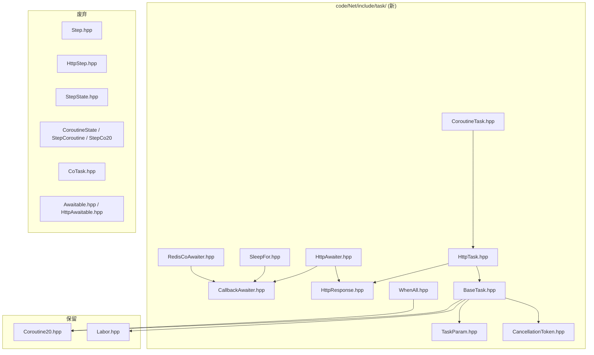

# Thunder 重构执行方案

> 生成时间：2026-03-20（v4 — 增补 Proto/Hello 构建链路与 wrk 压测说明，同步 Phase 1 落地进度）
> 最近更新：2026-03-20 — `libProto.so` + `ModuleHello.so` 编通；`deploy` 下 wrk 脚本；附录 D TODO 与 Worker HTTP→BaseTask 现状对齐
> 项目路径：`/home/administrator/interview-quicker/thunder`
> 本文档替代 `改造目标.md`，作为重构工作的唯一事实来源（Source of Truth）

---

## 一、设计哲学

**Step 是异步回调的产物，Task 是协程的产物。**

Step 存在的本质目的是"异步操作完成后找回回调上下文"——通过 Sequence 映射 Step 指针，框架在响应到达时调用 `Step::Callback()`。这套机制催生了：
- `Emit()` / `Callback()` / `Timeout()` 三个纯虚函数
- `NextStep()` / `m_pNextStep` 步骤链
- `m_setNextStepSeq` / `m_setPreStepSeq` 依赖追踪
- `AddStateFunc()` / `SetNextState()` 状态机

C++20 协程在**语言级别**保存了上下文。`co_await` 挂起时，编译器自动保存所有局部变量到协程帧；响应到达时，`handle.resume()` 直接从挂起点恢复执行。语言已经实现的能力不需要框架再实现一遍。

因此：**消除 Step 中所有为"找回回调"而存在的机制，只保留框架协议层和调度层必需的功能，重新命名为 Task 体系。**

---

## 二、现状诊断

### 2.1 四种异步编程模式并存

| 编号 | 模式 | 基类 | 协程返回类型 | Awaitable | 代表文件 |
|------|------|------|-------------|-----------|----------|
| 1 | StepState 状态机 | `HttpStep` → `StepState` | 无 | 无 | `StepHttpRequestState.hpp` |
| 2 | CoroutineState | `StepState` → `CoroutineState` | `CoTask<void>` | `Awaitable<T>` + `WaitForAsync` | `HttpRequestCo.hpp` |
| 3 | StepCoroutine | `HttpStep` → `StepCoroutine` | `CoTask` | `HttpAwaitable` | `StepHttpRequestCo.hpp` |
| 4 | StepCo20 | `HttpStep` → `StepCo20` | `Task<>` | `HttpRespAwaiter` | `StepHttpRequestCo20.hpp` |

### 2.2 类层次结构现状

```
Step (抽象基类: Emit/Callback/Timeout — 回调时代产物)
└── HttpStep (HTTP 操作: HttpGet/HttpPost/SendTo)
    ├── StepState (状态机: AddStateFunc/SetNextState/JumpNextState)
    │   ├── MysqlStep
    │   ├── StepCo (旧式非 C++20 协程)
    │   ├── CoroutineState (协程实现 1, 继承 StepState 的冗余状态机)
    │   └── [业务 StepState 子类]
    ├── StepCoroutine (协程实现 2)
    ├── StepCo20 (协程实现 3)
    ├── DataStep (数据载体)
    ├── StepNode (节点间通信)
    └── RedisStep (Redis 操作)
```

### 2.3 Step 中回调时代的遗留问题

| 功能 | 存在原因 | 协程下是否需要 |
|------|----------|--------------|
| `Emit()` 纯虚 | 启动异步操作 | 不需要 — `Run()` 协程入口取代 |
| `Callback()` 纯虚 | 响应到达时回调 | 不需要 — `co_await` 恢复取代 |
| `m_pNextStep` / `NextStep()` | 步骤链式调用 | 不需要 — 协程线性执行取代 |
| `m_setNextStepSeq` / `m_setPreStepSeq` | 步骤间依赖追踪 | 不需要 — 协程帧生命周期管理 |
| `AddPreStepSeq()` / `RemovePreStepSeq()` | 链式依赖 | 不需要 — 同上 |
| `DelayNextStep()` | 延迟下一步超时 | 不需要 — 协程按顺序执行 |
| `AddStateFunc()` / `SetNextState()` | 状态机 | 不需要 — 协程流程取代 |
| `DelayDel` / `m_boDelayDel` | 回调中再发回调的延迟删除 | 简化 — 协程帧自动管理 |

### 2.4 Step 中框架必须保留的功能

| 功能 | 原因 |
|------|------|
| `GetSequence()` | 协议级请求-响应匹配：seq 写入 MsgHead，响应按 seq 路由回来 |
| Timeout 管理 (ev_timer) | 网络操作可能超时，与协程无关 |
| 请求上下文 (MsgShell, MsgHead, MsgBody, HttpMsg) | 知道请求从哪来、回复给谁 |
| `SendToClient()` | 响应客户端 |
| Labor 访问 (`GetLabor()`) | 框架调度核心 |
| 生命周期 (registered, activeTime) | Worker 管理 Task 的必要状态 |

---

## 三、命名映射

| 旧名 | 新名 | 说明 |
|------|------|------|
| `Step` | `BaseTask` | 框架基类，仅保留协议层+调度层功能 |
| `HttpStep` | `HttpTask` | HTTP 操作能力，继承 BaseTask |
| `CoroutineStep` | `CoroutineTask` | 业务协程基类，继承 HttpTask |
| `StepState` | (废弃) | 状态机完全被协程取代 |
| `CoroutineState` | (废弃) | 被 CoroutineTask 统一替代 |
| `StepCoroutine` | (废弃) | 被 CoroutineTask 统一替代 |
| `StepCo20` | (废弃) | 被 CoroutineTask 统一替代 |
| `StepNode` | `NodeTask` | 节点间通信（框架内部） |
| `DataStep` | `DataTask` | 数据载体（框架内部） |
| `RedisStep` | `RedisTask` | Redis 操作 |
| `MysqlStep` | `MysqlTask` | MySQL 操作 |
| `StepParam` | `TaskParam` | 参数基类 |
| `CoTask` | (废弃) | 统一使用 `Task<T>` (Coroutine20.hpp) |
| `RegisterCallback(Step*)` | `RegisterTask(BaseTask*)` | Worker 注册接口 |
| `ExecStep(Step*)` | `ExecTask(BaseTask*)` | Worker 执行接口 |
| `m_mapCallbackStep` | `m_mapCallbackTask` | Worker 内部 seq→task 映射 |
| `DeleteCallback(Step*)` | `DeleteTask(BaseTask*)` | Worker 删除接口 |
| `StepTimeoutCallback` | `TaskTimeoutCallback` | libev 超时回调 |

---

## 四、目标架构

### 4.1 目标类层次

```
BaseTask (协程原生基类，从 Step 中提取框架必需功能)
├── virtual Task<void> Run() = 0    (协程入口，替代 Emit)
├── Sequence / Timeout / Context    (框架基础设施)
├── CancellationToken               (协程取消)
├── ResumeWithResponse()            (Worker 调用，替代 Callback 分发)
│
├── HttpTask : public BaseTask      (HTTP 操作能力，替代 HttpStep)
│   ├── HttpGet() / HttpPost()      (同步发送)
│   ├── HttpGetAsync() → co_await   (返回 HttpResponse)
│   ├── HttpPostAsync() → co_await  (返回 HttpResponse)
│   │
│   └── CoroutineTask : public HttpTask  (业务开发者使用的主基类)
│       └── [所有业务 Task]
│
├── RedisTask : public BaseTask     (Redis 操作，替代 RedisStep)
│   └── RedisAsync() → co_await     (返回 RedisResponse)
│
├── MysqlTask : public BaseTask     (MySQL 操作，替代 MysqlStep)
│   └── MysqlQueryAsync() → co_await
│
├── NodeTask : public BaseTask      (节点间通信，替代 StepNode，框架内部)
│
└── DataTask : public HttpTask      (数据载体，替代 DataStep，框架内部)
```

### 4.2 协程类型系统（不变）

**保留** `Coroutine20.hpp` 中的 `Task<T>` 和 `AsyncTask`，**废弃** `CoTask.hpp`。

```
统一使用:
  Task<T>     — 有返回值的协程任务（支持 co_await 链式调用）
  Task<void>  — 无返回值的协程任务
  AsyncTask   — fire-and-forget 协程
```

### 4.3 Awaitable 体系（不变）

```
CallbackAwaiter<T> (通用回调→协程适配器)
├── HttpGetAwaiter (co_await → HttpResponse)
├── HttpPostAwaiter (co_await → HttpResponse)
├── RedisCommandAwaiter (co_await → RedisResponse)
├── MysqlQueryAwaiter (co_await → MysqlResponse)
├── SleepForAwaiter (co_await → void, libev ev_timer)
└── [未来: 任意回调式 API 的协程化包装]

when_all(tasks...) — 并发执行多个 Task, 全部完成后返回
```

### 4.4 改造效果对比

```cpp
// ===== 改造前（StepState, 5 个状态函数, 回调模式）=====
class StepHttpRequestState : public StepState {
    StepHttpRequestState(...) {
        AddStateFunc((StepStateFunc)&StepHttpRequestState::State0);
        AddStateFunc((StepStateFunc)&StepHttpRequestState::State1);
        AddStateFunc((StepStateFunc)&StepHttpRequestState::State2);
    }
    // Emit() 启动 → State0 发送请求 → 框架保存 Step* → 响应到达
    // → 框架按 seq 找到 Step* → 调用 Callback → 进入 State1 → ...
    E_CMD_STATUS State0() { HttpGet("http://api1.com"); return RUNNING; }
    E_CMD_STATUS State1() { /* 从 m_oResHttpMsg 读结果 */ return RUNNING; }
    E_CMD_STATUS State2() { Response(0); return COMPLETED; }
};

// ===== 改造后（CoroutineTask, 单个线性函数, 协程模式）=====
class HttpRequestTask : public CoroutineTask {
    Task<void> Run() override {
        // co_await 挂起 → 编译器保存上下文到协程帧 → 响应到达
        // → 框架按 seq 找到 Task* → handle.resume() → 从挂起点恢复
        auto resp1 = co_await HttpGetAsync("http://api1.com");
        auto resp2 = co_await HttpGetAsync("http://api2.com");

        // 并发请求
        auto [r1, r2] = co_await when_all(
            HttpGetAsync("http://api3.com"),
            HttpGetAsync("http://api4.com")
        );

        // 延时
        co_await SleepFor(std::chrono::milliseconds(100));

        SendToClient(resp1.body);
        co_return;
    }
};
```

### 4.5 RegisterCallback 的协程化适配

```
旧模式（回调）:
┌──────────┐     RegisterCallback     ┌──────────────────────┐
│ 业务代码  │ ──── new Step ──────────→ │ Worker               │
│           │     pStep->Emit()        │ m_mapCallbackStep    │
│           │                          │ [seq] = pStep        │
└──────────┘                          └──────────────────────┘
                                              │
     响应到达 ←── oInMsgHead.seq() ───────────┘
                                              │
     pStep->Callback(stMsgShell, oInMsgHead, oInMsgBody)
     │
     └─→ 业务在 Callback 中处理结果，可能 new 下一个 Step...

新模式（协程）:
┌──────────────────────┐    内部注册    ┌──────────────────────┐
│ CoroutineTask::Run() │ ─ co_await ──→ │ Worker               │
│                      │   HttpGetAsync │ m_mapCallbackTask    │
│  auto resp = ...     │   (Awaiter     │ [seq] = pTask        │
│  // 挂起，等待响应    │    内部完成)    │                      │
└──────────────────────┘               └──────────────────────┘
                                              │
     响应到达 ←── oInMsgHead.seq() ───────────┘
                                              │
     pTask->ResumeWithResponse(oInMsgHead, oInMsgBody)
     │
     └─→ Awaiter.setValue(response) + handle.resume()
     │
     └─→ co_await 返回 resp，协程从挂起点继续执行
```

**关键区别**：
- 业务代码不再接触 `RegisterCallback`，全部由 Awaiter 内部完成
- Worker 的 seq→task 映射保留（协议层必需），但分发方式从 `Callback()` 改为 `ResumeWithResponse()`
- 不再需要 `Emit()` / `Callback()` 纯虚函数

---

## 五、接口定义（Interface / Types）

### 5.1 `TaskParam` — 参数基类（重命名自 StepParam）

文件：`code/Net/include/task/TaskParam.hpp`（新建）

```cpp
#pragma once

namespace net {

struct TaskParam {
    TaskParam() = default;
    virtual ~TaskParam() = default;
};

} // namespace net
```

### 5.2 `BaseTask` — 协程原生基类（替代 Step）

文件：`code/Net/include/task/BaseTask.hpp`（新建）

```cpp
#pragma once
#include "Coroutine20.hpp"
#include "CancellationToken.hpp"
#include "TaskParam.hpp"
#include "NetError.hpp"
#include "NetDefine.hpp"
#include "labor/Labor.hpp"
#include "cmd/CW.hpp"
#include <coroutine>
#include <set>
#include <string>

namespace net {

class Worker;

class BaseTask {
public:
    BaseTask() = default;
    BaseTask(const tagMsgShell& shell) : m_stReqMsgShell(shell) {}
    BaseTask(const tagMsgShell& shell, const MsgHead& head)
        : m_stReqMsgShell(shell), m_oReqMsgHead(head) {}
    BaseTask(const tagMsgShell& shell, const MsgHead& head, const MsgBody& body)
        : m_stReqMsgShell(shell), m_oReqMsgHead(head), m_oReqMsgBody(body) {}
    virtual ~BaseTask();

    // ===================== 协程入口 =====================
    // 子类必须实现。替代旧 Step 的 Emit()/Callback() 二段式。
    // Worker 启动 Task 时调用此函数，协程在 co_await 处挂起/恢复。
    virtual Task<void> Run() = 0;

    // ===================== 框架基础设施（从 Step 保留）=====================

    // Sequence: 协议级请求-响应匹配（seq 写入 MsgHead，响应按 seq 路由）
    uint32 GetSequence();

    // Timeout 管理
    void SetActiveTime(ev_tstamp t) { m_dActiveTime = t; }
    ev_tstamp GetActiveTime() const { return m_dActiveTime; }
    void SetTimeout(ev_tstamp t) { m_dTimeout = t; }
    ev_tstamp GetTimeout() const { return m_dTimeout; }
    void DelayTimeout();

    // 生命周期
    bool IsRegistered() const { return m_bRegistered; }
    const std::string& ClassName() const { return m_strClassName; }
    void SetClassName(const std::string& s) { m_strClassName = s; }

    // 请求上下文
    const tagMsgShell& GetReqMsgShell() const { return m_stReqMsgShell; }
    const MsgHead& GetReqMsgHead() const { return m_oReqMsgHead; }
    const MsgBody& GetReqMsgBody() const { return m_oReqMsgBody; }
    const HttpMsg& GetReqHttpMsg() const { return m_oInHttpMsg; }

    // 响应客户端
    bool SendToClient(const std::string& strBody, int nCode = 200);
    bool SendToClient(HttpMsg& oInHttpMsg, const std::string& strBody, int iCode);

    // 参数
    void SetData(TaskParam* data) { m_data = data; }
    TaskParam* GetData() { return m_data; }

    // ===================== 协程恢复机制（替代 Callback 分发）=====================

    // Worker 在响应到达时调用，内部恢复协程
    void ResumeWithResponse(const tagMsgShell& shell,
                            const MsgHead& head, const MsgBody& body);
    void ResumeWithHttpResponse(const tagMsgShell& shell, const HttpMsg& httpMsg);
    void ResumeWithError(int errNo, const std::string& errMsg);

    // Awaiter 调用，保存待恢复的协程句柄
    void SaveCoroutineHandle(std::coroutine_handle<> h) { m_coroHandle = h; }

    // 取消令牌：Timeout 时设置，Awaiter resume 前检查
    CancellationToken& GetCancellationToken() { return m_cancelToken; }

    // ===================== 超时处理 =====================
    // Worker 的 TaskTimeoutCallback 最终调用此方法。
    // 默认行为：检查重试次数，超限则取消协程。子类可 override。
    virtual void OnTimeout();
    void SetTimeoutParams(uint32 maxRetry = 3, uint8 retryOnTimeout = 0) {
        m_uiTimeOutMax = maxRetry;
        m_uiTimeOutRetry = retryOnTimeout;
    }

    // ===================== 钩子 =====================
    virtual void OnSucc() {}
    virtual void OnFail() {}

    // ===================== 描述 =====================
    void SetTaskDesc(const std::string& s) { m_strTaskDesc = s; }
    const std::string& GetTaskDesc() const { return m_strTaskDesc; }

    // 响应数据（供 Awaiter 写入，协程恢复后读取）
    HttpMsg m_oResHttpMsg;
    MsgHead m_oResMsgHead;
    MsgBody m_oResMsgBody;
    int m_iErrno = 0;
    std::string m_strErrMsg;

protected:
    void SetRegistered() { m_bRegistered = true; }
    void UnsetRegistered() { m_bRegistered = false; }

    // 请求上下文
    tagMsgShell m_stReqMsgShell;
    MsgHead m_oReqMsgHead;
    MsgBody m_oReqMsgBody;
    HttpMsg m_oInHttpMsg;

    // 超时参数
    uint32 m_uiTimeOutCounter = 0;
    uint32 m_uiTimeOutMax = 3;
    uint8  m_uiTimeOutRetry = 0;

private:
    bool m_bRegistered = false;
    uint32 m_ulSequence = 0;
    ev_tstamp m_dActiveTime = 0.0;
    ev_tstamp m_dTimeout = 0.5;
    ev_timer* m_pTimeoutWatcher = nullptr;
    std::string m_strClassName;
    std::string m_strTaskDesc = "BaseTask";
    TaskParam* m_data = nullptr;

    // 协程
    std::coroutine_handle<> m_coroHandle;
    bool m_bCoroutineStarted = false;
    CancellationToken m_cancelToken;

    friend class Labor;
    friend class Worker;
};

// ======== Step 中被消除的功能（协程不需要）========
// - Emit() 纯虚           → Run() 协程入口
// - Callback() 纯虚       → ResumeWithResponse() + co_await 恢复
// - m_pNextStep / NextStep → 协程线性执行
// - m_setNextStepSeq       → 协程帧生命周期
// - m_setPreStepSeq        → 协程帧生命周期
// - AddPreStepSeq()        → 不需要
// - RemovePreStepSeq()     → 不需要
// - DelayNextStep()        → 不需要
// - DelayDel / m_boDelayDel → 协程帧自动管理

} // namespace net
```

### 5.3 `HttpTask` — HTTP 操作基类（替代 HttpStep）

文件：`code/Net/include/task/HttpTask.hpp`（新建）

```cpp
#pragma once
#include "BaseTask.hpp"
#include "protocol/http.pb.h"
#include "codec/HttpCodec.hpp"
#include "HttpResponse.hpp"
#include "CallbackAwaiter.hpp"
#include <string>
#include <unordered_map>

namespace net {

class HttpGetAwaiter;
class HttpPostAwaiter;

class HttpTask : public BaseTask {
public:
    HttpTask() = default;
    HttpTask(const tagMsgShell& shell, const HttpMsg& httpMsg)
        : BaseTask(shell) { m_oInHttpMsg = httpMsg; }
    HttpTask(const tagMsgShell& shell, const MsgHead& head)
        : BaseTask(shell, head) {}
    HttpTask(const tagMsgShell& shell, const MsgHead& head, const MsgBody& body)
        : BaseTask(shell, head, body) {}
    virtual ~HttpTask() = default;

    // 同步发送（底层非阻塞，发到 fd 缓冲区）
    bool HttpGet(const std::string& strUrl);
    bool HttpPost(const std::string& strUrl, const std::string& strBody);
    bool HttpPost(const std::string& strUrl, const std::string& strBody,
                  const std::unordered_map<std::string, std::string>& mapHeaders);
    bool HttpRequest(const HttpMsg& oHttpMsg);
    bool SendTo(const tagMsgShell& stMsgShell, const HttpMsg& oHttpMsg);

    // 协程化异步操作（co_await 返回 HttpResponse）
    HttpGetAwaiter HttpGetAsync(const std::string& url);
    HttpPostAwaiter HttpPostAsync(const std::string& url, const std::string& body);
    HttpPostAwaiter HttpPostAsync(const std::string& url, const std::string& body,
                                  const std::unordered_map<std::string, std::string>& headers);
};

} // namespace net
```

### 5.4 `CoroutineTask` — 业务开发者的主基类

文件：`code/Net/include/task/CoroutineTask.hpp`（新建）

```cpp
#pragma once
#include "HttpTask.hpp"

namespace net {

// CoroutineTask 是业务开发者编写协程 Task 时继承的主基类。
// 它继承 HttpTask，具备 HTTP 操作能力和协程基础设施。
//
// 使用示例:
//   class MyTask : public CoroutineTask {
//       Task<void> Run() override {
//           auto resp = co_await HttpGetAsync("http://...");
//           SendToClient(resp.body);
//           co_return;
//       }
//   };
class CoroutineTask : public HttpTask {
public:
    CoroutineTask() = default;
    CoroutineTask(const tagMsgShell& shell, const HttpMsg& httpMsg)
        : HttpTask(shell, httpMsg) { SetTaskDesc("CoroutineTask"); }
    CoroutineTask(const tagMsgShell& shell, const MsgHead& head)
        : HttpTask(shell, head) { SetTaskDesc("CoroutineTask"); }
    CoroutineTask(const tagMsgShell& shell, const MsgHead& head, const MsgBody& body)
        : HttpTask(shell, head, body) { SetTaskDesc("CoroutineTask"); }
    virtual ~CoroutineTask() = default;
};

} // namespace net
```

### 5.5 `CallbackAwaiter<T>` — 通用回调→协程适配器

文件：`code/Net/include/task/CallbackAwaiter.hpp`（新建）

```cpp
#pragma once
#include <coroutine>
#include <optional>
#include <exception>

namespace net {

template <typename T>
struct CallbackAwaiter {
    bool await_ready() noexcept { return false; }

    const T& await_resume() const {
        if (exception_) std::rethrow_exception(exception_);
        return result_.value();
    }

protected:
    void setValue(T&& v) { result_.emplace(std::move(v)); }
    void setValue(const T& v) { result_.emplace(v); }
    void setException(const std::exception_ptr& e) { exception_ = e; }

private:
    std::optional<T> result_;
    std::exception_ptr exception_{nullptr};
};

template <>
struct CallbackAwaiter<void> {
    bool await_ready() noexcept { return false; }

    void await_resume() const {
        if (exception_) std::rethrow_exception(exception_);
    }

protected:
    void setException(const std::exception_ptr& e) { exception_ = e; }

private:
    std::exception_ptr exception_{nullptr};
};

} // namespace net
```

### 5.6 `HttpResponse` — HTTP 响应值类型

文件：`code/Net/include/task/HttpResponse.hpp`（新建）

```cpp
#pragma once
#include "protocol/http.pb.h"
#include <string>

namespace net {

struct HttpResponse {
    int statusCode = 0;
    std::string body;
    HttpMsg rawMsg;

    bool Ok() const { return statusCode >= 200 && statusCode < 300; }

    static HttpResponse FromHttpMsg(const HttpMsg& msg) {
        HttpResponse resp;
        resp.statusCode = msg.status_code();
        resp.body = msg.body();
        resp.rawMsg = msg;
        return resp;
    }
};

} // namespace net
```

### 5.7 `HttpGetAwaiter` / `HttpPostAwaiter`

文件：`code/Net/include/task/HttpAwaiter.hpp`（新建）

```cpp
#pragma once
#include "CallbackAwaiter.hpp"
#include "HttpResponse.hpp"
#include <coroutine>
#include <string>
#include <unordered_map>

namespace net {

class HttpTask;

class HttpGetAwaiter : public CallbackAwaiter<HttpResponse> {
public:
    HttpGetAwaiter(HttpTask* task, std::string url)
        : task_(task), url_(std::move(url)) {}

    // 保存协程句柄，调用 HttpTask::HttpGet() 发起请求。
    // 请求发出后协程挂起；响应到达时 Worker 调用
    // BaseTask::ResumeWithHttpResponse()，内部 setValue + handle.resume()。
    void await_suspend(std::coroutine_handle<> handle);

private:
    HttpTask* task_;
    std::string url_;
};

class HttpPostAwaiter : public CallbackAwaiter<HttpResponse> {
public:
    HttpPostAwaiter(HttpTask* task, std::string url, std::string body,
                    std::unordered_map<std::string, std::string> headers = {})
        : task_(task), url_(std::move(url)), body_(std::move(body)),
          headers_(std::move(headers)) {}

    void await_suspend(std::coroutine_handle<> handle);

private:
    HttpTask* task_;
    std::string url_;
    std::string body_;
    std::unordered_map<std::string, std::string> headers_;
};

} // namespace net
```

### 5.8 `CancellationToken` — 协程取消令牌

文件：`code/Net/include/task/CancellationToken.hpp`（新建）

```cpp
#pragma once
#include <atomic>

namespace net {

class CancellationToken {
public:
    void Cancel() { cancelled_.store(true, std::memory_order_release); }
    bool IsCancelled() const { return cancelled_.load(std::memory_order_acquire); }
    void Reset() { cancelled_.store(false, std::memory_order_release); }

private:
    std::atomic<bool> cancelled_{false};
};

} // namespace net
```

### 5.9 `when_all` — 并发原语

文件：`code/Net/include/task/WhenAll.hpp`（新建）

```cpp
#pragma once
#include "Coroutine20.hpp"
#include <tuple>
#include <atomic>
#include <coroutine>

namespace net {

namespace detail {

template <typename... Tasks>
struct WhenAllAwaiter {
    std::tuple<Tasks...> tasks_;
    std::tuple<typename Tasks::value_type...> results_;
    std::atomic<size_t> counter_;
    std::coroutine_handle<> continuation_;
    std::exception_ptr exception_;
    std::atomic_flag exceptionFlag_ = ATOMIC_FLAG_INIT;

    explicit WhenAllAwaiter(Tasks&&... tasks)
        : tasks_(std::move(tasks)...), counter_(sizeof...(Tasks)) {}

    bool await_ready() const noexcept { return sizeof...(Tasks) == 0; }

    void await_suspend(std::coroutine_handle<> handle) {
        continuation_ = handle;
        launch_all(std::index_sequence_for<Tasks...>{});
    }

    auto await_resume() {
        if (exception_) std::rethrow_exception(exception_);
        return std::move(results_);
    }

private:
    template <size_t... Is>
    void launch_all(std::index_sequence<Is...>) { (launch_one<Is>(), ...); }

    template <size_t Idx>
    void launch_one() {
        [](WhenAllAwaiter* self) -> AsyncTask {
            try {
                std::get<Idx>(self->results_) = co_await std::get<Idx>(self->tasks_);
            } catch (...) {
                if (self->exceptionFlag_.test_and_set() == false)
                    self->exception_ = std::current_exception();
            }
            if (self->counter_.fetch_sub(1, std::memory_order_acq_rel) == 1)
                self->continuation_.resume();
        }(this);
    }
};

} // namespace detail

template <typename... Tasks>
auto when_all(Tasks&&... tasks) {
    return detail::WhenAllAwaiter<Tasks...>(std::forward<Tasks>(tasks)...);
}

} // namespace net
```

### 5.10 `SleepFor` — 定时器协程化

文件：`code/Net/include/task/SleepFor.hpp`（新建）

```cpp
#pragma once
#include "CallbackAwaiter.hpp"
#include <chrono>
#include <coroutine>

struct ev_loop;
struct ev_timer;

namespace net {

class SleepForAwaiter : public CallbackAwaiter<void> {
public:
    SleepForAwaiter(ev_tstamp seconds, struct ev_loop* loop)
        : seconds_(seconds), loop_(loop) {}

    void await_suspend(std::coroutine_handle<> handle);

private:
    ev_tstamp seconds_;
    struct ev_loop* loop_;
    static void TimerCallback(struct ev_loop* loop, ev_timer* w, int revents);
};

inline SleepForAwaiter SleepFor(std::chrono::milliseconds ms, struct ev_loop* loop) {
    return SleepForAwaiter(static_cast<ev_tstamp>(ms.count()) / 1000.0, loop);
}

} // namespace net
```

### 5.11 `RedisResponse` + `RedisCommandAwaiter`

文件：`code/Net/include/task/RedisCoAwaiter.hpp`（新建）

```cpp
#pragma once
#include "CallbackAwaiter.hpp"
#include <coroutine>
#include <string>
#include <vector>
#include <cstdint>

namespace net {

class BaseTask;

struct RedisResponse {
    enum class Type { NIL, STRING, INTEGER, ARRAY, ERROR };
    Type type = Type::NIL;
    std::string str;
    int64_t integer = 0;
    std::vector<RedisResponse> elements;
    int errNo = 0;
    std::string errMsg;

    bool Ok() const { return type != Type::ERROR && errNo == 0; }
    bool IsNil() const { return type == Type::NIL; }
};

class RedisCommandAwaiter : public CallbackAwaiter<RedisResponse> {
public:
    RedisCommandAwaiter(BaseTask* task, std::string host, int port, std::string command)
        : task_(task), host_(std::move(host)), port_(port), command_(std::move(command)) {}

    void await_suspend(std::coroutine_handle<> handle);

private:
    BaseTask* task_;
    std::string host_;
    int port_;
    std::string command_;
};

class RedisCoHelper {
public:
    explicit RedisCoHelper(BaseTask* task, std::string host = "127.0.0.1", int port = 6379)
        : task_(task), host_(std::move(host)), port_(port) {}

    RedisCommandAwaiter Get(const std::string& key);
    RedisCommandAwaiter Set(const std::string& key, const std::string& value);
    RedisCommandAwaiter Del(const std::string& key);
    RedisCommandAwaiter HGet(const std::string& key, const std::string& field);
    RedisCommandAwaiter HSet(const std::string& key, const std::string& field, const std::string& value);
    RedisCommandAwaiter Expire(const std::string& key, int seconds);
    RedisCommandAwaiter Execute(const std::string& command);

private:
    BaseTask* task_;
    std::string host_;
    int port_;
};

} // namespace net
```

---

## 六、文件依赖关系变更列表

### 6.1 新建文件

新文件统一放在 `code/Net/include/task/` 和 `code/Net/src/task/` 目录下，与旧 `step/` 目录分离。

| 文件路径 | 说明 | 依赖 |
|----------|------|------|
| `code/Net/include/task/TaskParam.hpp` | 参数基类 | 无 |
| `code/Net/include/task/CancellationToken.hpp` | 协程取消令牌 | `<atomic>` |
| `code/Net/include/task/CallbackAwaiter.hpp` | 通用回调→协程适配器 | `<coroutine>`, `<optional>` |
| `code/Net/include/task/HttpResponse.hpp` | HTTP 响应值类型 | `protocol/http.pb.h` |
| `code/Net/include/task/BaseTask.hpp` | 协程原生基类 | `Coroutine20.hpp`, `CancellationToken.hpp`, `TaskParam.hpp`, `Labor.hpp` |
| `code/Net/include/task/HttpTask.hpp` | HTTP 操作基类 | `BaseTask.hpp`, `HttpResponse.hpp`, `HttpCodec.hpp` |
| `code/Net/include/task/HttpAwaiter.hpp` | HTTP 等待器 | `CallbackAwaiter.hpp`, `HttpResponse.hpp` |
| `code/Net/include/task/CoroutineTask.hpp` | 业务协程基类 | `HttpTask.hpp` |
| `code/Net/include/task/WhenAll.hpp` | 并发原语 | `Coroutine20.hpp` |
| `code/Net/include/task/SleepFor.hpp` | 定时器协程化 | `CallbackAwaiter.hpp`, libev |
| `code/Net/include/task/RedisCoAwaiter.hpp` | Redis 协程化 | `CallbackAwaiter.hpp` |
| `code/Net/src/task/BaseTask.cpp` | BaseTask 实现 | `BaseTask.hpp` |
| `code/Net/src/task/HttpTask.cpp` | HttpTask 实现 | `HttpTask.hpp` |
| `code/Net/src/task/HttpAwaiter.cpp` | HttpAwaiter 实现 | `HttpAwaiter.hpp`, `HttpTask.hpp` |
| `code/Net/src/task/SleepFor.cpp` | SleepFor 实现 | `SleepFor.hpp`, libev |
| `code/Net/src/task/RedisCoAwaiter.cpp` | RedisCoAwaiter 实现 | `RedisCoAwaiter.hpp` |

### 6.2 修改文件

| 文件路径 | 变更内容 |
|----------|----------|
| `code/Net/include/step/Coroutine20.hpp` | 为 `Task<T>` 添加 `using value_type = T` |
| `code/Net/include/labor/Labor.hpp` | 新增 `RegisterTask(BaseTask*)` / `ExecTask(BaseTask*)` / `DeleteTask(BaseTask*)`（保留旧 Step 接口供过渡） |
| `code/Net/include/labor/Worker.hpp` | 新增 `m_mapCallbackTask`、`TaskTimeoutCallback`（保留旧 `m_mapCallbackStep` 供过渡） |
| `code/Net/src/labor/Worker.cpp` | Dispose 中新增 BaseTask 分发路径；新增 `RegisterTask` / `TaskTimeoutCallback` 实现 |
| `code/Hello/src/ModuleHello/ModuleHello.cpp` | 默认路由使用 CoroutineTask 子类 |
| `CMakeLists.txt` | 添加 `task/` 目录下的新源文件 |

### 6.3 废弃文件（Phase 2 标记 deprecated，Phase 3 删除）

| 文件路径 | 替代 |
|----------|------|
| `code/Net/include/step/Step.hpp` | `task/BaseTask.hpp` |
| `code/Net/src/step/Step.cpp` | `task/BaseTask.cpp` |
| `code/Net/include/step/HttpStep.hpp` | `task/HttpTask.hpp` |
| `code/Net/include/step/StepState.hpp` | (废弃，无替代) |
| `code/Net/src/step/StepState.cpp` | (废弃) |
| `code/Net/include/step/CoroutineState.hpp` | `task/CoroutineTask.hpp` |
| `code/Net/src/step/CoroutineState.cpp` | `task/CoroutineTask.hpp` |
| `code/Net/include/step/StepCoroutine.hpp` | `task/CoroutineTask.hpp` |
| `code/Net/src/step/StepCoroutine.cpp` | `task/CoroutineTask.hpp` |
| `code/Net/include/step/StepCo20.hpp` | `task/CoroutineTask.hpp` |
| `code/Net/src/step/StepCo20.cpp` | `task/CoroutineTask.hpp` |
| `code/Net/include/step/CoTask.hpp` | `Coroutine20.hpp` 的 `Task<T>` |
| `code/Net/include/step/HttpAwaitable.hpp` | `task/HttpAwaiter.hpp` |
| `code/Net/include/step/Awaitable.hpp` | `task/CallbackAwaiter.hpp` |
| `code/Net/include/step/RedisAwaitable.hpp` | `task/RedisCoAwaiter.hpp` |
| `code/Net/include/step/StepNode.hpp` | `task/NodeTask.hpp`（后续创建） |
| `code/Net/include/step/RedisStep.hpp` | `task/RedisTask.hpp`（后续创建） |
| `code/Net/include/step/MysqlStep.hpp` | `task/MysqlTask.hpp`（后续创建） |

### 6.4 依赖关系图



---

## 七、核心逻辑拆解步骤

### 7.1 拆解总览

```
┌─────────────────────────────────────────────────────────────────────────┐
│ Phase 1: 过渡期 — BaseTask 暂时继承 Step (2 周)                          │
│                                                                         │
│  P0: 协程基础设施                                                        │
│   Step 1: CallbackAwaiter<T> + CancellationToken + HttpResponse         │
│   Step 2: BaseTask (继承 Step，override Emit/Callback/Timeout)          │
│   Step 3: HttpTask (继承 BaseTask，复用 HttpStep 的发送逻辑)             │
│   Step 4: CoroutineTask (继承 HttpTask)                                 │
│   Step 5: HttpAwaiter (HttpGetAsync → Task<HttpResponse>)               │
│                                                                         │
│  P1: 协程工具层                                                          │
│   Step 6: when_all 并发原语                                             │
│   Step 7: SleepFor (libev ev_timer)                                     │
│   Step 8: RedisCoAwaiter / MysqlCoAwaiter                               │
│                                                                         │
│  P2: Hello 示例迁移 + 测试                                               │
│   Step 9: Hello 模块迁移到 CoroutineTask                                │
│   Step 10: 单元测试验证                                                  │
├─────────────────────────────────────────────────────────────────────────┤
│ Phase 2: Worker 直接支持 BaseTask (2 周)                                 │
│                                                                         │
│   Step 11: Worker 新增 m_mapCallbackTask + RegisterTask + ExecTask      │
│   Step 12: Worker::Dispose 新增 BaseTask 分发路径                        │
│   Step 13: TaskTimeoutCallback 实现                                     │
│   Step 14: BaseTask 去掉对 Step 的继承，成为独立基类                      │
│   Step 15: 旧 Step/StepState/三套协程实现 标记 [[deprecated]]            │
├─────────────────────────────────────────────────────────────────────────┤
│ Phase 3: 全面迁移 + 清理 (2 周)                                          │
│                                                                         │
│   Step 16: 批量迁移业务 Step → CoroutineTask                            │
│   Step 17: NodeTask / DataTask / RedisTask / MysqlTask 实现              │
│   Step 18: 移除旧 Step 继承链，Worker 仅支持 BaseTask                    │
│   Step 19: 删除废弃文件                                                  │
├─────────────────────────────────────────────────────────────────────────┤
│ Phase 4: 增强 (持续)                                                     │
│                                                                         │
│   Step 20: Middleware 洋葱模型                                           │
│   Step 21: CRTP 自动注册                                                │
│   Step 22: CMake 统一 / Docker / clang-tidy                             │
│   Step 23: 性能基准测试                                                  │
└─────────────────────────────────────────────────────────────────────────┘
```

---

## 八、分步实施计划

### Phase 1: 过渡期 — BaseTask 继承 Step（2 周）

Phase 1 的核心策略：BaseTask 暂时继承 Step，在内部 override `Emit()`/`Callback()`/`Timeout()` 实现协程语义，复用 Worker 现有的 `m_mapCallbackStep` 和调度逻辑。**业务代码使用新 API（Run / co_await），框架内部通过旧接口桥接。**

#### Step 1: 基础设施文件

新建 `code/Net/include/task/` 目录及以下文件：
- `TaskParam.hpp`
- `CancellationToken.hpp`
- `CallbackAwaiter.hpp`（含 `<T>` 和 `<void>` 特化）
- `HttpResponse.hpp`

为 `Coroutine20.hpp` 的 `Task<T>` 添加 `using value_type = T;`

**检查清单**：
- [ ] task/ 目录创建
- [ ] 4 个基础文件编译通过
- [ ] CallbackAwaiter 单元测试

#### Step 2: BaseTask（过渡期继承 Step）

新建 `code/Net/include/task/BaseTask.hpp` 和 `code/Net/src/task/BaseTask.cpp`

过渡期实现要点：
```cpp
// 过渡期：BaseTask 继承 Step，桥接到 Worker 现有调度
class BaseTask : public Step {
public:
    virtual Task<void> Run() = 0;

    // override Step 的纯虚函数，内部实现协程语义
    E_CMD_STATUS Emit(...) override {
        // 启动 Run() 协程
        if (!m_bCoroutineStarted) {
            m_bCoroutineStarted = true;
            m_cancelToken.Reset();
            [](BaseTask* self) -> AsyncTask {
                try { co_await self->Run(); self->OnSucc(); }
                catch (...) { self->OnFail(); }
            }(this);
            return STATUS_CMD_RUNNING;
        }
        return STATUS_CMD_RUNNING;
    }

    E_CMD_STATUS Callback(const tagMsgShell&, const MsgHead&, const MsgBody&, void*) override {
        // 保存响应，恢复协程
        ResumeWithResponse(...);
        return IsCoroutineDone() ? STATUS_CMD_COMPLETED : STATUS_CMD_RUNNING;
    }

    E_CMD_STATUS Timeout() override {
        OnTimeout();
        return STATUS_CMD_COMPLETED;
    }
};
```

这样 Worker 的 `RegisterCallback(Step*)` / `ExecStep(Step*)` / `m_mapCallbackStep` 天然兼容。

**检查清单**：
- [ ] BaseTask 类定义（继承 Step）
- [ ] Emit() 启动协程
- [ ] Callback() → ResumeWithResponse() 桥接
- [ ] Timeout() → OnTimeout() 桥接
- [ ] Worker 兼容性验证

#### Step 3: HttpTask

新建 `code/Net/include/task/HttpTask.hpp` 和 `code/Net/src/task/HttpTask.cpp`

过渡期：HttpTask 继承 BaseTask，复用 HttpStep 的发送逻辑（通过 Step → HttpStep 的继承链或者直接调用 Labor 的发送方法）。

```cpp
class HttpTask : public BaseTask {
    // 通过 GetLabor()->AutoSend() 或直接复用 HttpStep 的实现
    bool HttpGet(const std::string& url);
    bool HttpPost(const std::string& url, const std::string& body);
    // ...
};
```

**检查清单**：
- [ ] HttpTask 发送方法实现
- [ ] HTTP 回调走 BaseTask::Callback() → ResumeWithHttpResponse()

#### Step 4: CoroutineTask

新建 `code/Net/include/task/CoroutineTask.hpp`

CoroutineTask 是 HttpTask 的薄封装，主要作用是提供清晰的业务继承入口。

**检查清单**：
- [ ] CoroutineTask 编译通过
- [ ] 最简业务 Task 继承测试

#### Step 5: HttpAwaiter

新建 `code/Net/include/task/HttpAwaiter.hpp` 和 `code/Net/src/task/HttpAwaiter.cpp`

`HttpGetAwaiter::await_suspend()` 实现：
```cpp
void HttpGetAwaiter::await_suspend(std::coroutine_handle<> handle) {
    task_->SaveCoroutineHandle(handle);
    bool ok = task_->HttpGet(url_);
    if (!ok) {
        setException(std::make_exception_ptr(std::runtime_error("HttpGet failed")));
        handle.resume();
    }
    // 请求已发出，协程挂起等待响应
    // 响应到达时 Worker::Dispose → BaseTask::Callback() → ResumeWithHttpResponse()
    //   → setValue(HttpResponse::FromHttpMsg(msg)) + handle.resume()
}
```

**检查清单**：
- [ ] HttpGetAwaiter 实现
- [ ] HttpPostAwaiter 实现
- [ ] `co_await HttpGetAsync(url)` 返回 HttpResponse
- [ ] CancellationToken 检查

#### Step 6-8: 工具层

同原方案：
- Step 6: `when_all` 并发原语
- Step 7: `SleepFor` (libev ev_timer)
- Step 8: `RedisCoAwaiter` / `MysqlCoAwaiter`

#### Step 9: Hello 示例迁移

将 Hello 模块迁移到新 Task 体系：

```cpp
// 旧 (CoroutineState, 继承 StepState)
class HttpRequestCo : public net::CoroutineState { ... };

// 新 (CoroutineTask)
class HttpRequestTask : public net::CoroutineTask {
    Task<void> Run() override {
        auto resp = co_await HttpGetAsync("http://...");
        SendToClient(resp.body);
        co_return;
    }
};
```

**检查清单**：
- [ ] `HttpRequestTask` 命名与示例编写（与文档统一）
- [ ] ModuleHello 路由更新为上述 Task
- [x] 保留旧 StepState / Co20 等示例作对照
- [x] 端到端：`libProto` + `ModuleHello.so` + wrk 脚本（见附录 E）

#### Step 10: 单元测试

- [ ] 更新 `test/test_http_awaitable.cpp` → 使用 HttpTask + HttpGetAwaiter
- [ ] 更新 `test/test_cotask.cpp` → 使用 Task<T>
- [ ] 新增 `test/test_when_all.cpp`
- [ ] 新增 `test/test_sleep_for.cpp`

---

### Phase 2: Worker 直接支持 BaseTask（2 周）

Phase 1 完成后，BaseTask 通过继承 Step 桥接到 Worker。Phase 2 的目标是让 Worker **原生支持** BaseTask，不再需要 Step 作为中间层。

#### Step 11: Worker 新增 Task 调度

在 `Worker.hpp` 中新增：
```cpp
std::unordered_map<uint32, BaseTask*> m_mapCallbackTask;

bool RegisterTask(BaseTask* pTask, ev_tstamp dTimeout = 0.0);
void DeleteTask(BaseTask* pTask);
bool ExecTask(BaseTask* pTask, ev_tstamp dTimeout = 0.0);
static void TaskTimeoutCallback(struct ev_loop* loop, ev_timer* watcher, int revents);
```

在 `Labor.hpp` 中新增对应虚函数。

**检查清单**：
- [ ] RegisterTask 实现（m_mapCallbackTask 插入 + ev_timer 注册）
- [ ] DeleteTask 实现（取消定时器 + 从 map 移除 + delete）
- [ ] ExecTask 实现（注册 + 启动 Run()）
- [ ] TaskTimeoutCallback 实现

#### Step 12: Worker::Dispose 适配

在 Worker 的响应分发逻辑中，新增 BaseTask 路径：

```cpp
// Worker::Dispose (Protobuf 响应)
auto task_iter = m_mapCallbackTask.find(oInMsgHead.seq());
if (task_iter != m_mapCallbackTask.end()) {
    BaseTask* pTask = task_iter->second;
    pTask->SetActiveTime(ev_now(m_loop));
    pTask->ResumeWithResponse(stMsgShell, oInMsgHead, oInMsgBody);
    if (pTask->IsCoroutineDone()) {
        DeleteTask(pTask);
    }
    return true;
}
// fallback 到旧 m_mapCallbackStep 路径（过渡期兼容）

// Worker::Dispose (HTTP 响应)
// 类似逻辑：从 m_mapHttpAttr 找到 seq → m_mapCallbackTask 查找 → ResumeWithHttpResponse
```

**检查清单**：
- [ ] Protobuf 响应分发适配
- [ ] HTTP 响应分发适配
- [ ] MySQL 响应分发适配
- [ ] Redis 响应分发适配

#### Step 13: TaskTimeoutCallback

```cpp
void Worker::TaskTimeoutCallback(struct ev_loop* loop, ev_timer* watcher, int revents) {
    if (watcher->data) {
        BaseTask* pTask = (BaseTask*)watcher->data;
        ev_tstamp after = pTask->GetActiveTime() - ev_now(loop) + pTask->GetTimeout();
        if (after > 0) {
            // 在超时前被刷新过，重新设置定时器
            ev_timer_set(watcher, after, 0.0);
            ev_timer_start(loop, watcher);
        } else {
            pTask->OnTimeout();
            ((Worker*)GetLabor())->DeleteTask(pTask);
        }
    }
}
```

#### Step 14: BaseTask 脱离 Step

所有 Task 和 Worker 适配完成后，BaseTask 不再继承 Step。删除桥接代码（Emit/Callback/Timeout override），BaseTask 成为独立基类。

Worker 中旧的 `m_mapCallbackStep` 路径仍保留（供未迁移的旧 Step 使用），但新代码全部走 `m_mapCallbackTask`。

#### Step 15: 标记 deprecated

```cpp
[[deprecated("Use net::BaseTask / net::CoroutineTask instead")]]
class Step { ... };

[[deprecated("Use net::HttpTask instead")]]
class HttpStep { ... };

[[deprecated("Removed. Use net::CoroutineTask")]]
class StepState { ... };
```

---

### Phase 3: 全面迁移 + 清理（2 周）

#### Step 16: 批量迁移业务 Step → CoroutineTask

| 文件 | 旧基类 | 新基类 |
|------|--------|--------|
| `code/Hello/src/ModuleLocateData/StepLocateData.hpp` | `Step` | `CoroutineTask` |
| `code/Hello/src/ModuleHello/*.hpp` | 各种 | `CoroutineTask` |
| `code/Center/src/ModuleAdmin/StepGetConfig.hpp` | `Step` | `CoroutineTask` |
| `code/Center/src/ModuleAdmin/StepSetConfig.hpp` | `Step` | `CoroutineTask` |
| `code/Logic/src/CmdGetToken/*.cpp` | 间接 | 按需 |

**迁移模板**：
```cpp
// 旧
class MyStep : public StepState {
    MyStep(...) { AddStateFunc(...); AddStateFunc(...); }
    E_CMD_STATUS State0() { HttpGet(url); return RUNNING; }
    E_CMD_STATUS State1() { /* m_oResHttpMsg */ return COMPLETED; }
};

// 新
class MyTask : public CoroutineTask {
    Task<void> Run() override {
        auto resp = co_await HttpGetAsync(url);
        SendToClient(resp.body);
        co_return;
    }
};
```

#### Step 17: 框架内部 Task

- `NodeTask`（替代 StepNode）：继承 BaseTask，用于 `SendToCallback` 场景
- `DataTask`（替代 DataStep）：继承 HttpTask，用于数据载体
- `RedisTask`（替代 RedisStep）：继承 BaseTask
- `MysqlTask`（替代 MysqlStep）：继承 BaseTask

#### Step 18: Worker 清理

- 移除 `m_mapCallbackStep`，全部使用 `m_mapCallbackTask`
- 移除 `StepTimeoutCallback`，只保留 `TaskTimeoutCallback`
- 移除 Worker 中所有 `Step*` 相关的旧代码路径

#### Step 19: 删除废弃文件

删除 `code/Net/include/step/` 下所有废弃文件，保留 `Coroutine20.hpp`（移到 `task/` 或 `coro/` 目录）。

---

### Phase 4: 增强（持续）

#### Step 20: Middleware 洋葱模型

```cpp
class Middleware {
public:
    virtual Task<HttpMsg> Invoke(const HttpMsg& request, MiddlewareNextAwaiter&& next) = 0;
};
```

#### Step 21: CRTP 自动注册

减少 Cmd/Module 手动注册样板代码。

#### Step 22: 工程化

- CMake 统一构建（`task/` 源文件加入 `thunder_core`）
- Docker 标准化
- clang-tidy + clang-format

#### Step 23: 性能基准测试

- StepState 5 状态 vs CoroutineTask 单函数
- 协程帧分配/销毁开销
- when_all 并发 vs 串行
- 10K 并发协程内存占用

---

## 九、Worker 改造详解

Worker 是 Step/Task 调度的核心。以下是 Worker 中需要适配的关键流程：

### 9.1 注册流程

```
旧: Step::RegisterCallback(Step* pStep)
    → GetLabor()->RegisterCallback(GetSequence(), pStep)
    → Worker::RegisterCallback(Step*)
    → m_mapCallbackStep[seq] = pStep
    → AddStep(pStep, dTimeout, StepTimeoutCallback)

新: Awaiter 内部自动完成
    → co_await HttpGetAsync(url)
    → HttpGetAwaiter::await_suspend(handle)
    → task->SaveCoroutineHandle(handle)
    → task->HttpGet(url)     // 发送请求，seq 已在 MsgHead 中
    // Worker 的 m_mapCallbackTask[seq] = pTask (在 ExecTask 时已注册)
```

### 9.2 响应分发流程

```
旧: Worker::Dispose
    → m_mapCallbackStep.find(oInMsgHead.seq())
    → pStep->Callback(stMsgShell, oInMsgHead, oInMsgBody)
    → 业务在 Callback 中处理

新: Worker::Dispose
    → m_mapCallbackTask.find(oInMsgHead.seq())
    → pTask->ResumeWithResponse(stMsgShell, oInMsgHead, oInMsgBody)
    → 内部: m_oResMsgHead = head; m_oResMsgBody = body;
    → 内部: Awaiter.setValue(...) + m_coroHandle.resume()
    → co_await 返回结果，协程继续执行
```

### 9.3 超时流程

```
旧: StepTimeoutCallback → Worker::StepTimeout(pStep)
    → pStep->Timeout()
    → 业务在 Timeout 中决定重试或放弃

新: TaskTimeoutCallback → Worker::TaskTimeout(pTask)
    → pTask->OnTimeout()
    → 默认: m_cancelToken.Cancel()
    → Awaiter resume 前检查 IsCancelled()，如已取消则不 resume
    → 协程帧由框架安全销毁
```

---

## 十、风险评估与缓解

| 风险 | 影响 | 缓解措施 |
|------|------|----------|
| Phase 1 BaseTask 继承 Step 可能引入 Step 的遗留问题 | 中 | 过渡期短（2 周），Phase 2 立即脱离 |
| Worker Dispose 双路径（Step + Task）增加复杂度 | 中 | Phase 2 先 Task 路径，Phase 3 移除 Step 路径 |
| 协程帧 Timeout 后 use-after-free | 高 | CancellationToken + Awaiter resume 前检查 |
| 批量迁移破坏现有业务 | 高 | Phase 1-2 旧 Step 代码不动，Phase 3 渐进迁移 |
| 编译器 C++20 协程支持 | 低 | 项目已使用 `-fcoroutines`，已验证 |

---

## 十一、验收标准

1. **哲学清晰**：代码中不再有 `Callback()` 纯虚函数，不再有 `Emit()` 模式
2. **命名统一**：所有新代码使用 Task 命名（BaseTask / HttpTask / CoroutineTask）
3. **代码简洁**：5 个 State 函数 → 1 个 `Run()` 协程函数
4. **类型安全**：`co_await HttpGetAsync()` 返回 `HttpResponse`
5. **并发能力**：`when_all` 支持多个请求并发
6. **性能**：与原 StepState 相当或更优
7. **兼容性**：过渡期旧 Step 代码仍可运行
8. **安全性**：Timeout 路径无 use-after-free
9. **无 Step 残留**：Phase 3 完成后，Step 体系完全移除

---

## 十二、时间线总览

```
Week 1-2:  Phase 1 — BaseTask 过渡期
             P0: 基础设施 + BaseTask + HttpTask + CoroutineTask + HttpAwaiter（已落地代码）
             P1: when_all + SleepFor + RedisCoAwaiter（已落地）；Mysql 协程化待需要时补齐
             P2: Hello 迁移 + 测试（示例 StepCo20 已接 ModuleHello；统一 HttpRequestTask 命名与路由仍待办）
             构建/验收: code/Proto → libProto.so；ModuleHello.so；deploy wrk 压测脚本（见附录 E）

Week 3-4:  Phase 2 — Worker 原生支持
             Worker m_mapCallbackTask + RegisterTask + ExecTask
             Worker::Dispose 适配
             BaseTask 脱离 Step 继承
             旧代码 deprecated

Week 5-6:  Phase 3 — 全面迁移
             批量业务迁移
             NodeTask / DataTask / RedisTask / MysqlTask
             Worker 清理旧 Step 路径
             删除废弃文件

持续:       Phase 4 — 增强
             Middleware / CRTP / CMake / Docker / Benchmark
```

---

## 十三、代码简化分析

通过对 Thunder 代码库的全面扫描，以下是可以简化或移除的代码，按优先级分类。

### 13.1 可立即移除的死代码

| 优先级 | 文件路径 | 原因 |
|--------|----------|------|
| 高 | `code/Net/src/step/sys_step/StepIoTimeout.hpp`、`StepIoTimeout.cpp` | Worker.cpp:1006 调用已注释；`Worker.cpp` 已不再 `#include StepIoTimeout.hpp`（文件可物理删除以完成清理） |
| 高 | `code/Hello/src/ModuleHello/StepHttpRequestCo.hpp`、`StepHttpRequestCo.cpp` | 继承 StepCoroutine 的旧协程示例，ModuleHello.cpp 中无入口引用（已被 StepHttpRequestCo20 取代） |
| 高 | `code/Util/src/dbi/leveldb/LevelDb.hpp`、`LevelDb.cpp`、`test_leveldb.cpp` | `CLevelDbi` 类未被任何业务代码引用 |
| 高 | `code/Util/src/algorithm/CalcCrc.hpp` | 无任何引用 |
| 高 | `code/Util/src/algorithm/Cache.hpp`、`Cache.cpp` | 无任何引用 |
| 中 | `code/Util/src/algorithm/Similarity.hpp`、`Similarity.cpp` | 仅被 `Logic/src/Define.h` include，但 Logic 中无实际调用 |
| 中 | `code/Util/src/thread/threadpool.h`、`Main.cpp` | 仅自测 Main.cpp 使用，Thunder 业务逻辑未引用该线程池 |

### 13.2 条件编译下的废弃路径

`USE_COROUTINE` 宏在 `NetDefine.hpp:42` 已被注释，以下文件在该宏未启用时完全不参与编译，属于旧式（非 C++20）协程实现，可整条路径删除：

| 文件路径 | 说明 |
|----------|------|
| `code/Net/include/step/StepCo.hpp`、`code/Net/src/step/StepCo.hpp`、`StepCo.cpp` | 旧式协程 Step 基类 |
| `code/Net/src/dispatcher/Coroutine.h`、`Coroutine.cpp` | 旧式协程调度器（基于 ucontext/setjmp） |
| `code/Util/src/coroutine/coroutine.h`、`coroutine.cpp` | 底层旧式协程库 |

注意：`StepHttpRequestState.hpp` 包含 `StepCo.hpp` 但仅使用其末尾的 `StepStateFunc`/`StepFinalFunc` 类型定义。移除前需将这两个类型定义迁移到 `StepState.hpp` 或 `BaseTask.hpp`。

### 13.3 待确认移除项

| 文件路径 | 情况 | 建议 |
|----------|------|------|
| `code/Net/src/storage/MongoOperator.hpp`、`MongoOperator.cpp` + `3party/mongo-c-driver` | `MemOperator.hpp` 包含 `MongoOperator.hpp`，但从未实例化 `MongoOperator`。BSON API 仅在 `MongoOperator.cpp` 内部使用 | 确认无 MongoDB 需求后移除 |
| 旧协程三套实现（`CoroutineState`、`StepCoroutine`、`StepCo20`） | 将被 `CoroutineTask` 统一替代 | Phase 3 统一删除 |
| `code/Net/include/step/CoTask.hpp` | 被 `Coroutine20.hpp` 的 `Task<T>` 取代 | Phase 3 删除 |
| `code/Net/include/step/Awaitable.hpp`、`HttpAwaitable.hpp`、`RedisAwaitable.hpp` | 被新的 `CallbackAwaiter` + 专用 Awaiter 取代 | Phase 3 删除 |

### 13.4 Makefile / 链接清理

| 文件 | 变更 |
|------|------|
| `code/Net/src/makefile.center` | 移除 `-lleveldb` 链接 |
| `code/Net/src/makefile.other` | 移除 `-lleveldb` 链接 |
| 各 Makefile | 若确认不需要 MongoDB，移除 mongo-c-driver 相关编译/链接选项 |
| `code/Net/src/labor/Worker.cpp` | ~~移除 `#include "StepIoTimeout.hpp"`~~（已完成）；可选删除 `StepIoTimeout.*` 源文件 |

### 13.5 简化收益估算

| 类别 | 预计移除代码行数 | 移除依赖 |
|------|-----------------|----------|
| 死代码（13.1） | ~1,500 行 | leveldb |
| 旧协程路径（13.2） | ~2,000 行 | 无 |
| 待确认项（13.3） | ~3,000 行 | mongo-c-driver（可选） |
| Step 体系（Phase 3） | ~5,000 行 | 无 |
| **合计** | **~11,500 行** | leveldb, mongo-c-driver（可选） |

---

## 十四、多进程 vs 多线程架构对比（Thunder vs Drogon）

### 14.1 为什么现代框架多选择多线程

近年来的高性能 C++ 网络框架（Drogon、Muduo、Seastar 等）几乎都采用多线程模型，原因包括：

1. **共享内存零拷贝**：线程间天然共享地址空间，连接上下文、Session、缓存等数据无需序列化/反序列化即可传递
2. **更简单的状态共享**：Session 管理、全局配置、路由表等只需加锁或使用 lock-free 结构，不需要 IPC 中转
3. **协程与 EventLoop 的天然适配**：C++20 协程通常在单线程 EventLoop 中运行，`co_await` 挂起/恢复不涉及线程切换。多线程模型中每个线程一个 EventLoop，协程天然归属于所在线程
4. **容器化部署友好**：Kubernetes/Docker 环境下，单进程更易管理（资源限制、优雅退出、信号处理、cgroup 内存统计）
5. **现代 OS 调度效率**：Linux 线程切换成本已降至微秒级，且 futex 等机制使锁竞争代价极小
6. **调试与观测性**：单进程内所有线程可被 gdb attach、perf 采样、pprof 等工具统一观测

### 14.2 Thunder 多进程架构详解

Thunder 采用 **Manager + N Worker** 的多进程模型，类似 Nginx 的 master-worker 架构：

```
┌─────────────────────────────────────────────────────────┐
│ Manager 进程                                             │
│  - 监听 S2S/C2S 端口                                     │
│  - accept 连接后选择负载最低的 Worker                       │
│  - 通过 Unix socket 传递 fd 给 Worker                     │
│  - SIGCHLD 监听 → 自动重启崩溃的 Worker                    │
│  - 周期性向 Center 上报状态                                │
│                                                         │
│  ┌──────────┐ ┌──────────┐ ┌──────────┐                │
│  │ Control  │ │ Control  │ │ Control  │  socketpair    │
│  │ Channel  │ │ Channel  │ │ Channel  │  (心跳/配置)    │
│  └────┬─────┘ └────┬─────┘ └────┬─────┘                │
│  ┌────┴─────┐ ┌────┴─────┐ ┌────┴─────┐                │
│  │  Data    │ │  Data    │ │  Data    │  socketpair    │
│  │ Channel  │ │ Channel  │ │ Channel  │  (fd 传递)     │
│  └────┬─────┘ └────┬─────┘ └────┬─────┘                │
└───────┼────────────┼────────────┼───────────────────────┘
        │            │            │
   ┌────┴────┐  ┌────┴────┐  ┌────┴────┐
   │Worker 0 │  │Worker 1 │  │Worker 2 │  ... Worker N
   │ libev   │  │ libev   │  │ libev   │
   │ loop    │  │ loop    │  │ loop    │
   └─────────┘  └─────────┘  └─────────┘
```

**核心机制**：

| 机制 | 实现细节 | 关键代码位置 |
|------|----------|-------------|
| 进程创建 | `socketpair()` × 2 + `fork()`，子进程创建 Worker 实例并运行 `Worker::Run()` | `Manager.cpp:CreateWorker()` |
| 双通道 IPC | Control 通道（心跳/配置/负载上报）+ Data 通道（fd 传递/数据转发），均为 Unix domain socket | `Manager.cpp:918-970` |
| fd 传递 | 通过 `SCM_RIGHTS` + `sendmsg()`/`recvmsg()` 在进程间传递文件描述符 | `Util/src/unix/process_helper.c:send_fd_with_attr()` |
| 负载均衡 | `GetMinLoadWorkerDataFd()` 遍历 Worker 列表，选择 `iLoad` 最小的 Worker | `Manager.cpp:1249-1269` |
| 崩溃恢复 | `SIGCHLD` → `waitpid()` → `RestartWorker()`：关闭旧 fd、新建 socketpair、重新 fork | `Manager.cpp:OnChildTerminated()` |
| 心跳超时 | `CheckWorker()` 检测心跳超时 → `kill(pid, SIGKILL)` → 触发重启 | `Manager.cpp:1697-1714` |
| 配置热更新 | `mmap(MAP_SHARED|MAP_ANON)` 创建共享内存块（`LoaderConfigVersionMM`），Manager/Loader 写入，Worker 读取 | `Attribution.hpp:135-148` |
| 服务发现 | Center 独立节点，接收 `NodeReport` 上报，通过 `NodeNotice` 下发路由变更 | `Center/src/CmdNodeRegister/` |

### 14.3 Drogon 多线程架构详解

Drogon 采用 **单进程 + EventLoopThreadPool** 的 Reactor 模型：

```
┌────────────────────────────────────────────────────┐
│ 进程 (单一)                                         │
│                                                    │
│  Main Thread (主 EventLoop)                         │
│   - 插件初始化 / 路由注册 / AOP 钩子                   │
│   - 主循环 getLoop()->loop()                        │
│                                                    │
│  ┌──────────────────────────────────────────────┐  │
│  │ EventLoopThreadPool (N 个 IO 线程)            │  │
│  │  ┌──────────┐ ┌──────────┐ ┌──────────┐     │  │
│  │  │IO Loop 0 │ │IO Loop 1 │ │IO Loop 2 │ ... │  │
│  │  │ epoll    │ │ epoll    │ │ epoll    │     │  │
│  │  │ 连接管理  │ │ 连接管理  │ │ 连接管理  │     │  │
│  │  └──────────┘ └──────────┘ └──────────┘     │  │
│  └──────────────────────────────────────────────┘  │
│                                                    │
│  连接分配方式:                                       │
│   A) 主 loop accept → round-robin 分发到 IO loop    │
│   B) SO_REUSEPORT: 每个 IO loop 各自 listen+accept  │
│                                                    │
│  跨线程投递: conn->getLoop()->queueInLoop(callback)  │
└────────────────────────────────────────────────────┘
```

**关键特性**：

| 特性 | 实现 |
|------|------|
| 线程模型 | `app().setThreadNum(N)` 或配置 `threads_num`（默认 0 = CPU 核数） |
| 连接归属 | 一个连接只属于一个 IO loop，其 fd 只在该 loop 的 epoll 中监听 |
| 跨线程通信 | `EventLoop::queueInLoop()` / `runInLoop()` 投递回调到目标线程 |
| 协程集成 | `Task<T>` + `CallbackAwaiter<T>` + `sleepCoro()` + `switchThreadCoro()` |
| 进程恢复 | `relaunchOnError` 选项：父进程 fork 子进程，子进程崩溃后重启（非多进程负载均衡） |
| ORM | `drogon_orm` 支持 MySQL/PostgreSQL/SQLite，异步协程化查询 |
| 中间件 | `HttpMiddleware` 洋葱模型 + `AopAdvice` 切面 |

### 14.4 架构对比

| 维度 | Thunder（多进程） | Drogon（多线程） |
|------|-------------------|------------------|
| **隔离性** | 进程级隔离，单 Worker 崩溃不影响其他 Worker 和 Manager | 线程级，任一线程崩溃导致全进程退出 |
| **自动恢复** | Manager 监听 SIGCHLD，自动 fork 新 Worker 替代 | 需外部守护（systemd/supervisord），`relaunchOnError` 仅重启整个进程 |
| **数据共享** | 进程间需 IPC（Unix socket + Protobuf 序列化）或 mmap 共享内存 | 线程间直接共享内存，零拷贝 |
| **Session 共享** | 跨 Worker 需通过 Center 或 Redis 中转 | 内存直接访问（加锁或 lock-free） |
| **上下文切换开销** | 进程切换涉及页表切换、TLB flush，成本较高 | 线程切换仅保存/恢复寄存器，成本低 |
| **内存占用** | 每个 Worker 独立地址空间（COW 缓解，但堆分配独立） | 共享地址空间，内存利用率更高 |
| **fd 传递** | 需 `SCM_RIGHTS` 通过 Unix socket 传递 | 线程间 fd 天然可用 |
| **容器化部署** | 多进程需 PID namespace 配合，资源统计需 cgroup v2 | 单进程，天然适配 Docker/K8s |
| **协议支持** | Protobuf + HTTP + 自定义协议混合 | 以 HTTP/WebSocket 为主 |
| **服务发现** | 内置 Center 节点，支持多节点注册/路由/状态上报 | 无内置，依赖 etcd/Consul/DNS 等外部方案 |
| **配置热更新** | 支持（mmap 共享内存 + Loader 进程） | 需重启进程 |
| **协程成熟度** | 正在改造（本方案），协程基础设施尚不完善 | 成熟：`Task<T>` + `CallbackAwaiter` + ORM 协程化 + `when_all` |
| **插件/中间件** | 有 Cmd/Module 模块化机制 | 完善的 Plugin + Middleware + AOP + Filter 体系 |
| **ORM** | 无内置 ORM（手动 SQL 或 MysqlStep） | 内置 `drogon_orm`，支持异步协程化查询 |

### 14.5 Thunder 应保持多进程架构的理由

尽管多线程模型在现代框架中更主流，Thunder 的多进程架构在其目标场景下仍有独特优势：

1. **进程级故障隔离是核心竞争力**：在金融交易、游戏服务器等场景中，单个 Worker 处理逻辑错误（段错误、死循环、内存泄漏）不会波及其他 Worker。Manager 自动重启机制保证了服务的高可用性
2. **Center 服务发现 + 多节点编排是差异化能力**：Thunder 天然支持分布式微服务架构，多个 Thunder 节点（不同 `node_type`）组成服务集群，Center 统一管理路由和负载
3. **Protobuf + HTTP 混合协议是业务需求**：内部服务间使用 Protobuf 高效通信，对外通过 HTTP 提供 API，这种混合模式在 Drogon 中需要额外适配
4. **配置热更新无需重启**：通过 Loader 进程 + mmap 共享内存实现配置无缝更新，对长连接服务至关重要
5. **安全边界清晰**：进程间地址空间隔离天然防止了内存越界、野指针等问题的传播

**结论：保持多进程架构不变，将协程改造限定在单 Worker 进程内部。** 每个 Worker 仍然是单线程 + libev 事件循环，协程在该线程内 co_await/resume，不引入多线程复杂度。

### 14.6 可借鉴 Drogon 的改进点

| 改进项 | Drogon 做法 | Thunder 计划 | 阶段 |
|--------|------------|-------------|------|
| `CallbackAwaiter<T>` | 通用回调→协程适配模板 | 已采纳到 `task/CallbackAwaiter.hpp` | Phase 1 |
| `when_all` | 并发等待多个 Task | 已采纳到 `task/WhenAll.hpp` | Phase 1 |
| `SleepFor` / `sleepCoro` | 定时器协程化 | 已采纳到 `task/SleepFor.hpp` | Phase 1 |
| `switchThreadCoro` | 切换到指定 EventLoop | 不需要（单线程模型） | N/A |
| Middleware 洋葱模型 | `HttpMiddleware` + `passMiddlewares()` | Phase 4 计划实现 | Phase 4 |
| 协程 Mutex | `drogon::Mutex` 基于 EventLoop | 未来考虑（当前单线程无竞争） | 未来 |
| ORM 协程化 | `CoroMapper<T>` 异步 CRUD | 可参考设计 `MysqlCoAwaiter` 的高级封装 | Phase 1+未来 |
| `co_future()` / `sync_wait()` | 协程与同步代码桥接 | 可在需要时添加（如测试框架） | 未来 |

---

## 附录 A: 迁移速查表

开发者迁移一个 StepState 到 CoroutineTask 的快速步骤：

1. 将 `: public StepState` 改为 `: public CoroutineTask`
2. 删除构造函数中所有 `AddStateFunc(...)` 调用
3. 删除所有 `State0()`、`State1()`... 状态函数
4. 新增 `Task<void> Run() override`
5. 将 `HttpGet(url)` + `return RUNNING` 替换为 `auto resp = co_await HttpGetAsync(url)`
6. 将 `m_oResHttpMsg` 读取替换为 `resp.body` / `resp.rawMsg`
7. 将 `return COMPLETED` 替换为 `co_return`
8. 删除 `SetNextState()` / `JumpNextState()` 调用
9. 删除 `RegisterCallback()` 调用（Awaiter 内部处理）
10. 如果多个请求互不依赖，用 `when_all` 包装实现并发

## 附录 B: 长远方向

### IO 引擎演进：libev → io_uring

保持多进程单线程事件循环模型不变，只替换底层 IO 多路复用机制。不建议换 asio（与多进程模型冲突）。

### 错误处理演进

当前使用异常 + `HttpResponse.Ok()` 模式，未来可迁移到 `std::expected<T, NetError>`（需 C++23）。

---

## 附录 C: 参考资源

- [Drogon 协程实现 (CallbackAwaiter)](https://github.com/drogonframework/drogon/blob/master/lib/inc/drogon/utils/coroutine.h)
- [Drogon CoroMapper](https://github.com/drogonframework/drogon/blob/master/orm_lib/inc/drogon/orm/CoroMapper.h)
- [C++20 协程标准](https://en.cppreference.com/w/cpp/language/coroutines)
- [libev 文档](http://software.schmorp.de/pkg/libev.html)
- [io_uring 介绍](https://unixism.net/loti/)

---

## 附录 D: TODO 清单

以下是整个重构项目的统一任务清单，按阶段分组。完成一项后勾选 `[x]`。

### Phase 1: 过渡期 — 基础设施 + BaseTask 继承 Step（Week 1-2）

**Step 1: 基础设施文件**
- [x] 创建 `code/Net/include/task/` 目录
- [x] 新建 `TaskParam.hpp`
- [x] 新建 `CancellationToken.hpp`
- [x] 新建 `CallbackAwaiter.hpp`（含 `<T>` 和 `<void>` 特化）
- [x] 新建 `HttpResponse.hpp`
- [x] 为 `Coroutine20.hpp` 的 `Task<T>` 添加 `using value_type = T;`
- [x] 基础文件与 Net 工程编译通过
- [ ] CallbackAwaiter 单元测试（补充断言与 CI）

**Step 2: BaseTask（过渡期继承 Step）**
- [x] 新建 `BaseTask.hpp` + `BaseTask.cpp`
- [x] BaseTask 类定义（继承 Step）
- [x] `Emit()` override → 启动 `Run()` 协程
- [x] `Callback()` override → `ResumeWithResponse()` 桥接
- [x] `Timeout()` override → `OnTimeout()` 桥接
- [x] Worker 兼容性验证（通过现有 `m_mapCallbackStep` 调度）

**Step 3: HttpTask**
- [x] 新建 `HttpTask.hpp` + `HttpTask.cpp`
- [x] HttpTask 发送方法实现（`HttpGet`/`HttpPost`/`SendTo`）
- [x] HTTP 回调走 `BaseTask::Callback()` → `ResumeWithHttpResponse()`

**Step 4: CoroutineTask**
- [x] 新建 `CoroutineTask.hpp` + `CoroutineTask.cpp`
- [x] CoroutineTask 编译通过
- [x] Hello 中 `StepHttpRequestCo20` 等继承验证

**Step 5: HttpAwaiter**
- [x] 新建 `HttpAwaiter.hpp` + `HttpAwaiter.cpp`
- [x] `HttpGetAwaiter::await_suspend()` 实现
- [x] `HttpPostAwaiter::await_suspend()` 实现
- [x] `co_await HttpGetAsync(url)` 返回 `HttpResponse` 验证
- [x] CancellationToken 取消检查

**Step 6-8: 工具层**
- [x] `WhenAll.hpp` — `when_all` 并发原语实现
- [x] `SleepFor.hpp` + `SleepFor.cpp` — libev ev_timer 协程化
- [x] `RedisCoAwaiter.hpp` + `RedisCoAwaiter.cpp` — Redis 协程化
- [ ] MysqlCoAwaiter（如需要）

**Step 9: Hello 示例迁移**
- [ ] 编写统一命名的 `HttpRequestTask`（继承 CoroutineTask，与文档示例对齐）
- [ ] ModuleHello 路由更新为使用 `HttpRequestTask`（当前仍为 `AnyMessage` + 多种 Step/Co20 示例并存）
- [x] 保留旧 StepState / StepCo 等示例作对照
- [x] 端到端：`libProto.so` + `ModuleHello.so` 编通；`deploy/tests/test_helloserver_wrk.sh` 压测入口可用（见附录 E）

**Step 10: 单元测试**
- [ ] 更新 `test/test_http_awaitable.cpp` → 使用 HttpTask + HttpGetAwaiter
- [ ] 更新 `test/test_cotask.cpp` → 使用 `Task<T>`
- [ ] 新增 `test/test_when_all.cpp`
- [ ] 新增 `test/test_sleep_for.cpp`

### Phase 2: Worker 原生支持 BaseTask（Week 3-4）

**Step 11: Worker 新增 Task 调度**
- [ ] `Worker.hpp` 新增 `m_mapCallbackTask` 成员
- [ ] `RegisterTask()` 实现（map 插入 + ev_timer 注册）
- [ ] `DeleteTask()` 实现（取消定时器 + map 移除 + delete）
- [ ] `ExecTask()` 实现（注册 + 启动 `Run()`）
- [ ] `TaskTimeoutCallback` 静态回调实现
- [ ] `Labor.hpp` 新增对应虚函数

**Step 12: Worker::Dispose 适配**
- [ ] Protobuf 响应分发 → `m_mapCallbackTask` 查找 → `ResumeWithResponse()`
- [ ] HTTP 响应分发 → `m_mapCallbackTask` 查找 → `ResumeWithHttpResponse()`（**当前**：仍用 `m_mapCallbackStep`，对 **`dynamic_cast<BaseTask*>`** 成功则 `ResumeWithHttpResponse()`）
- [ ] MySQL 响应分发适配
- [ ] Redis 响应分发适配
- [x] fallback 到旧 `m_mapCallbackStep` 路径（过渡期兼容，当前主路径）

**Step 13: TaskTimeoutCallback**
- [ ] 超时前刷新检测（`after > 0` 重设定时器）
- [ ] 超时后 `OnTimeout()` → `CancellationToken.Cancel()` → `DeleteTask()`

**Step 14: BaseTask 脱离 Step**
- [ ] 移除 `BaseTask : public Step` 继承
- [ ] 删除 `Emit()`/`Callback()`/`Timeout()` override 桥接代码
- [ ] BaseTask 成为独立基类，所有成员从 Step 复制到 BaseTask
- [ ] 验证 Worker 通过 `m_mapCallbackTask` 正常调度

**Step 15: 标记 deprecated**
- [ ] `Step` 类添加 `[[deprecated]]`
- [ ] `HttpStep` 类添加 `[[deprecated]]`
- [ ] `StepState` / `CoroutineState` / `StepCoroutine` / `StepCo20` 添加 `[[deprecated]]`

### Phase 3: 全面迁移 + 清理（Week 5-6）

**Step 16: 批量业务迁移**
- [ ] `Hello/ModuleHello/*.hpp` 全部迁移到 CoroutineTask
- [ ] `Hello/ModuleLocateData/StepLocateData.hpp` 迁移
- [ ] `Center/ModuleAdmin/StepGetConfig.hpp` 迁移
- [ ] `Center/ModuleAdmin/StepSetConfig.hpp` 迁移

**Step 17: 框架内部 Task**
- [ ] `NodeTask`（替代 StepNode）实现
- [ ] `DataTask`（替代 DataStep）实现
- [ ] `RedisTask`（替代 RedisStep）实现
- [ ] `MysqlTask`（替代 MysqlStep）实现

**Step 18: Worker 清理**
- [ ] 移除 `m_mapCallbackStep`
- [ ] 移除 `StepTimeoutCallback`
- [ ] 移除 Worker 中所有 `Step*` 相关旧代码路径

**Step 19: 删除废弃文件**
- [ ] 删除 `code/Net/include/step/` 下所有废弃文件（Step.hpp、HttpStep.hpp、StepState.hpp、CoroutineState.hpp、StepCoroutine.hpp、StepCo20.hpp、CoTask.hpp、Awaitable.hpp、HttpAwaitable.hpp、RedisAwaitable.hpp）
- [ ] 将 `Coroutine20.hpp` 移到 `task/` 或 `coro/` 目录
- [ ] 删除对应的 `.cpp` 实现文件

### Phase 4: 增强（持续）

- [ ] Step 20: Middleware 洋葱模型实现
- [ ] Step 21: CRTP 自动注册减少样板代码
- [ ] Step 22: CMake 统一构建 + Docker 标准化 + clang-tidy/clang-format
- [ ] Step 23: 性能基准测试（StepState vs CoroutineTask、协程帧开销、when_all 并发 vs 串行、10K 并发协程内存）

### 代码清理（可与 Phase 3 并行）

**高优先级 — 死代码移除**
- [x] ~~清理 Worker.cpp 中的 `#include "StepIoTimeout.hpp"`~~（已完成）
- [x] 物理删除 `StepIoTimeout.hpp` / `StepIoTimeout.cpp`（已从仓库移除）
- [x] 移除 `Hello/ModuleHello/StepHttpRequestCo.hpp` / `StepHttpRequestCo.cpp`（已移除；示例以 `StepHttpRequestCo20` 为准）
- [ ] 移除 `Util/src/dbi/leveldb/` 整个目录
- [ ] 移除 `Util/src/algorithm/CalcCrc.hpp`
- [ ] 移除 `Util/src/algorithm/Cache.hpp` / `Cache.cpp`

**中优先级**
- [ ] 移除 `Util/src/algorithm/Similarity.hpp` / `Similarity.cpp`，清理 `Logic/src/Define.h` 中的 include
- [ ] 移除 `Util/src/thread/` 目录
- [ ] 从 `makefile.center`、`makefile.other` 移除 `-lleveldb`

**低优先级 — 旧协程路径**
- [~] 移除 `USE_COROUTINE` 相关代码：`StepCo.*`（已删）、`dispatcher/Coroutine.h`/`Coroutine.cpp`（已删）、`Labor` 不再可选继承 `Coroutine`；`Util/src/coroutine/*`（仍保留，底层 ucontext，未链入 `libNet`/`Hello`）
- [x] ~~将 `StepStateFunc`/`StepFinalFunc` 从 `StepCo.hpp` 迁出~~（已在 `StepState.hpp` 末尾 typedef；`StepCo.hpp` 已删除）

**待确认**
- [ ] 确认是否需要 MongoDB → 若不需要则移除 `MongoOperator.*` + mongo-c-driver

---

## 附录 E: Proto / Hello 插件构建与 wrk 压测

本节记录 **protobuf 7.x** 环境下 `libProto.so` + `ModuleHello.so` 的编译要点，以及 **Helloserver** 的 wrk 验收方式（与重构任务并行，用于联调与性能基线）。

### E.1 `libProto.so`（`code/Proto/src`）

- **标准**：`-std=c++20`。
- **头文件顺序**：`code/3party/protobuf/src`、`absl` 相关路径须排在 `code/3party/include` **之前**，避免混用不匹配的 `google/protobuf` 头。
- **链接**：`-L ../../3party/protobuf/build`、`-L .../utf8_range`、`-lprotobuf -lutf8_validity`（protobuf 7 依赖 utf8_validity）。
- **产物**：`make` 成功后 `libProto.so` 拷贝到 `deploy/lib`（以 Makefile 中 `cp` 规则为准）。

### E.2 `.proto` 再生成与 GCC 补丁

- **脚本**：`code/Proto/regen_cpp.sh`（调用 `3party/protobuf/build/protoc` → `patch_common_pb_h.py` → 对 `common.pb.cc` 批量 `sed`）。
- **脚本换行**：须为 **Unix 换行（LF）**；若在 Windows 编辑过出现 `bash\r`，需 `sed -i 's/\r$//' regen_cpp.sh`。
- **已知问题**：protoc 生成 `common.pb.h` 首段 `namespace common` 内仅前向声明 `class Foo;` 时，会导致 `common.pb.cc` 中 `offsetof` / `PROTOBUF_FIELD_OFFSET` 在 **不完整类型** 上求值。
  - **处理**：`patch_common_pb_h.py` 删除首段中仅 `class 标识符;` 的前向声明行（保留 `struct …GlobalsTypeInternal` 与 `extern`）；对若干 message 名在 `common.pb.cc` 中将 `PROTOBUF_FIELD_OFFSET(Foo,` 改为 `PROTOBUF_FIELD_OFFSET(::common::Foo,`（`offsetof` 同理）。
- **修改任意 `.proto` 后**：在 `code/Proto` 执行 `./regen_cpp.sh && cd src && make`。

### E.3 `ModuleHello.so`（`code/Hello/src/ModuleHello`）

- **依赖**：`-I` 与 Proto 一致（protobuf/absl 顺序）、`-std=c++20`、`-lProto`、`-lcryptopp`、protobuf + utf8 库路径与 `-lprotobuf -lutf8_validity`；`-I` 需包含 Net 头（如 `step/StepCo20.hpp` 等）。
- **protobuf 7 JSON 工具**：`JsonOptions` → `JsonPrintOptions`；`google::protobuf::util::Status` → `absl::Status`；错误码/信息使用 `absl::Status` 的 `code()` / `message()`（勿用已移除的 `error_code()` / `error_message()`）。
- **工程小改动（与插件编译相关）**：`StepCo20` 中 `m_strStepDesc` 需对子类可写时改为 `protected`；`ModuleHello` 侧头文件与 `.cpp` 成员声明保持一致（如 `Response`）。

### E.4 wrk 压测（`deploy/tests/`）

| 文件 | 说明 |
|------|------|
| `tests/test_helloserver_wrk.sh` | 封装 `wrk`，默认 `HELLO_HOST=127.0.0.1`、`HELLO_PORT=27006`、`HELLO_PATH=/hello/hello`（与 `deploy/Hello/conf/Hello.json` 中 `access_*` 与 `module.url_path` 一致） |
| `tests/wrk_helloserver.lua` | `POST` + `Content-Type: application/json`，body `{"option":"Echo"}`（与 `ModuleHello::TestMsg` 中 Echo 分支一致） |

**用法**（在 `deploy/` 目录下）：先 `./tests/start_helloserver.sh`，再 `./tests/test_helloserver_wrk.sh`。可通过环境变量覆盖线程/连接数/时长（见脚本内注释）。

**结果**：样例输出可记录在 `deploy/tests/wrk_test_result.md`；若 wrk 统计中出现大量 **Non-2xx**，请核对服务端实际 HTTP 状态行/响应格式是否与 wrk 预期一致。

### E.5 与附录 D 的对应关系

- **Proto/Hello 编通** ≠ Phase 1 全部完成；仅保证 **依赖库与插件** 可构建、可加载。
- **Worker HTTP 路径**：当前已通过 `dynamic_cast<BaseTask*>` 对 `m_mapCallbackStep` 中注册的 Step 做 **协程恢复**（`ResumeWithHttpResponse`），**尚未**引入独立的 `m_mapCallbackTask`（见附录 D Phase 2）。

### E.6 `step/` 精简现状（与「可删 / 保留」清单）

以下文件**已从仓库移除**（由 `task/` + `CoroutineTask` / `StepCo20` 替代或已无引用）：

| 已移除 | 说明 |
|--------|------|
| `StepCoroutine.hpp` / `StepCoroutine.cpp` | 旧 `HttpAwaitable` + `CoTask.hpp` 路径，无业务引用 |
| `CoTask.hpp`（旧版 `class CoTask`） | 与 `Coroutine20.hpp` 的 `Task<T>` 重复 |
| `HttpAwaitable.hpp` / `HttpAwaitable.cpp` | 同上 |
| `StepCo.hpp` / `StepCo.cpp` | `USE_COROUTINE` 未启用；`StepStateFunc`/`StepFinalFunc` 已在 `StepState.hpp` 末尾 typedef |
| `sys_step/StepIoTimeout.*` | Worker 侧调用已注释 |
| `Hello/.../StepHttpRequestCo.hpp` / `.cpp` | 无入口；示例以 `StepHttpRequestCo20` 为准 |
| `dispatcher/Coroutine.h` / `Coroutine.cpp` | 旧栈协程调度（`USE_COROUTINE` 未启用）；`Labor` 已固定为不继承 `Coroutine` |

**仍保留**（Hello 示例与 `CoroutineState` 演示仍依赖，迁移到 `CoroutineTask` 后再删）：`StepState`、`CoroutineState`、`Awaitable.hpp`、`RedisAwaitable.hpp`、`StepCo20.hpp`（及对应 `.cpp`）。

**集成测试**：原 `integration-test/` 与根目录 `Dockerfile.test` 已从仓库移除（未接入日常构建）；若需联调测试请自行恢复或重写。
